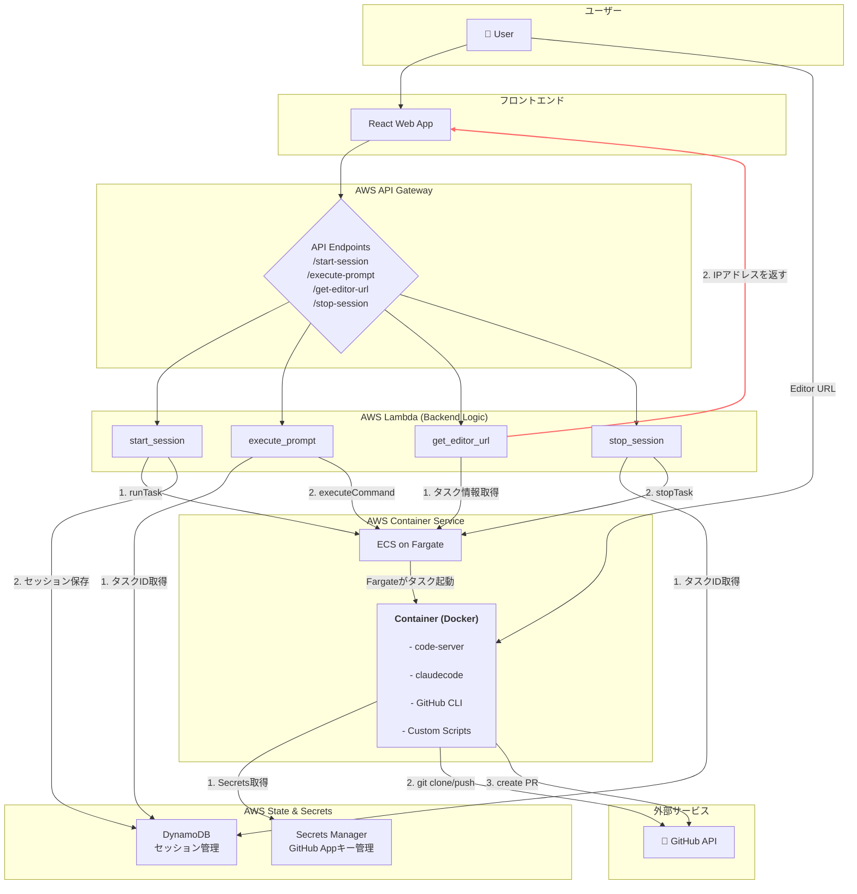
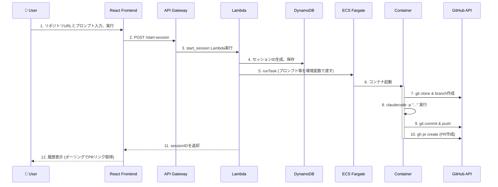
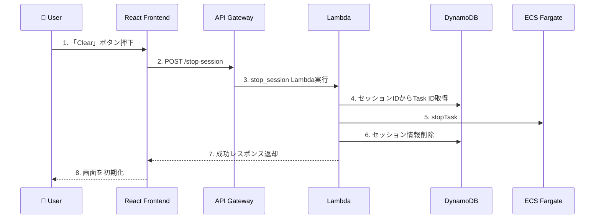

はい、承知いたしました。
これまでのやり取りを基に、システム「**DevFlow Engine**」の要件定義書として整理します。Mermaidを活用し、システムの全体像とワークフローを視覚的に表現します。

-----

# **要件定義書: DevFlow Engine**

| ドキュメントバージョン | 1.0 |
| :--- | :--- |
| **作成日** | 2025年8月18日 |
| **システム名** | DevFlow Engine |
| **概要** | 自然言語プロンプトを起点とし、コードの自動編集、プルリクエスト作成、および一時的な開発環境の提供までをシームレスに行う、オンデマンド型AI開発支援システム。 |

-----

## 1\. システムの目的とゴール

### 1.1. 目的

開発者が持つアイデアや修正指示（自然言語）を、具体的なコード変更（プルリクエスト）へと変換するプロセスを最大限に自動化・効率化する。これにより、単純な修正作業から開発者を解放し、より創造的な業務に集中できる環境を提供する。

### 1.2. ゴール

  * **開発サイクルの高速化**: プロンプト入力からプルリクエスト作成までの時間を平均5分以内に短縮する。
  * **レビュー品質の向上**: PR本文にプロンプトと変更差分が自動記載されるため、レビュアーのコンテキスト理解を助け、レビューの質と速度を向上させる。
  * **環境構築コストの削減**: オンデマンドでクリーンな開発環境を提供し、ローカル環境の汚染や差異に起因する問題を解消する。

-----

## 2\. システム構成図

本システムは、React製のフロントエンドと、AWSのサーバーレスコンポーネントを全面的に活用したバックエンドで構成される。

-----

## 3\. 機能要件

### FR-01: 初回セッション開始とPR自動作成機能

  * ユーザーはWeb UIからGitHubリポジトリURLと初回プロンプトを入力できる。
  * 「実行」ボタン押下時、バックエンドは新しいECSコンテナを起動する。
  * コンテナは指定されたリポジトリをクローンし、新しい作業ブランチを作成する。
  * コンテナはプロンプトを基に`claudecode`を実行し、コードを非対話的に編集する。
  * 編集後、変更内容をコミットし、リモートリポジトリにプッシュする。
  * GitHub Appとして認証し、変更内容を含むプルリクエストを自動作成する。
  * PRの本文には、実行されたプロンプトとコードの変更差分（diff）が記載される。
  * フロントエンドは、作成されたPRのリンクとコメント履歴を表示する。

### FR-02: 追加プロンプト実行機能

  * 初回セッション実行後、ユーザーは同じ画面から追加のプロンプトを入力できる。
  * 追加プロンプトは、既に起動している同一のコンテナ内で実行される。
  * 追加のコード編集、コミット、プッシュが実行される（同一PRが更新される）。
  * フロントエンドは、追加実行の履歴を一覧に追記していく。

### FR-03: インタラクティブなWeb Editor機能

  * 初回セッション実行後、フロントエンドに「Editor」ボタンが表示される。
  * ボタン押下時、実行中の`code-server`環境が新しいブラウザタブで開かれる。
  * ユーザーはWeb Editor上で、自動編集されたコードの確認や手動での微調整が可能。

### FR-04: セッション終了機能

  * フロントエンドの「Clear」ボタン押下時、バックエンドは対応するECSコンテナを停止する。
  * コンテナの停止により、不要なコンピューティングリソースを解放し、コストを最適化する。
  * フロントエンドの画面は初期状態に戻る。

-----

## 4\. 非機能要件

### NFR-01: セキュリティ

  * **認証**: GitHubとの連携は、ユーザーに紐づくPATではなく、権限を限定した**GitHub App**を用いて行う。
  * **秘密情報管理**: GitHub Appの秘密鍵や各種APIキーはすべて**AWS Secrets Manager**で一元管理し、実行時にコンテナへ安全に渡される。
  * **アクセス制御**: `code-server`のエンドポイントはパブリックに公開されるため、IPアドレス制限などのアクセス制御機構を実装する必要がある。

### NFR-02: スケーラビリティ

  * バックエンドはAWS Lambda、コンテナ実行環境はECS Fargate、状態管理はDynamoDBと、すべてサーバーレスアーキテクチャで構成する。
  * これにより、ユーザー数や同時実行セッション数の増加に応じて、インフラが自動でスケールする。

-----

## 5\. 主要なワークフロー

### 5.1. ワークフロー1: 初回セッション開始とPR作成

### 5.2. ワークフロー2: セッション終了

-----

## 6\. 技術スタック

| 領域 | 技術 | 目的 |
| :--- | :--- | :--- |
| **フロントエンド** | React | ユーザーインターフェースの構築 |
| **API** | Amazon API Gateway | RESTful APIのエンドポイント提供 |
| **バックエンド** | AWS Lambda (Python, Boto3) | ビジネスロジックの実行 |
| **状態管理** | Amazon DynamoDB | セッションとECSタスクのマッピング |
| **コンテナ実行** | Amazon ECS on Fargate | `code-server`コンテナの実行 |
| **コンテナ定義** | Docker | 実行環境のコード化 |
| **Web IDE** | code-server | インタラクティブなWeb Editor |
| **AIコード編集** | claudecode | プロンプトベースのコード編集 |
| **GitHub連携** | GitHub CLI (`gh`), GitHub App | PR作成、リポジトリ操作の自動化 |
| **秘密情報管理** | AWS Secrets Manager | APIキー、SSHキー、秘密鍵の保管 |

-----

## 7\. 前提条件・制約事項

  * 本システムはAWSおよびGitHubのアカウントを保有していることを前提とする。
  * 対象となるGitHubリポジトリには、作成したGitHub Appがインストールされている必要がある。
  * `claudecode`の実行には、Anthropic APIキーがSecrets Managerに正しく設定されている必要がある。
  * ネットワークの遅延やGitHub APIのレート制限により、処理時間が変動する可能性がある。