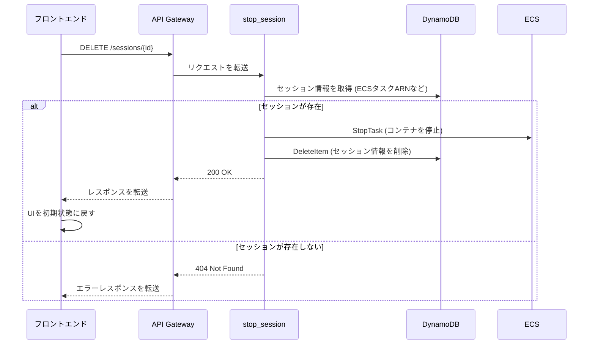

# API詳細設計書: /sessions/{session_id}

## 1. エンドポイント

`DELETE /sessions/{session_id}`

## 2. 概要

指定されたセッションを終了し、関連するリソース（ECSコンテナなど）をクリーンアップする。

## 3. リクエスト

### 3.1. パスパラメータ

| 名前 | 型 | 必須 | 説明 |
| :--- | :--- | :--- | :--- |
| `session_id` | String | ○ | 終了したいセッションのID (UUID v4)。 |

### 3.2. ヘッダー

| 名前 | 型 | 必須 | 説明 |
| :--- | :--- | :--- | :--- |
| `X-API-Key` | String | ○ | 認証用のAPIキー |
| `X-User-ID` | String | ○ | リクエスト元のユーザーを識別するID |

## 4. レスポンス

### 4.1. 成功 (200 OK)

```json
{
  "message": "セッションを終了しました"
}
```

### 4.2. エラーレスポンス

| HTTPステータス | エラーコード | 説明 |
| :--- | :--- | :--- |
| 404 Not Found | `session_not_found` | 指定された`session_id`が存在しない。 |
| 500 Internal Server Error | `internal_error` | サーバー内部で予期せぬエラーが発生した（ECSタスクの停止失敗など）。 |

## 5. シーケンス図


