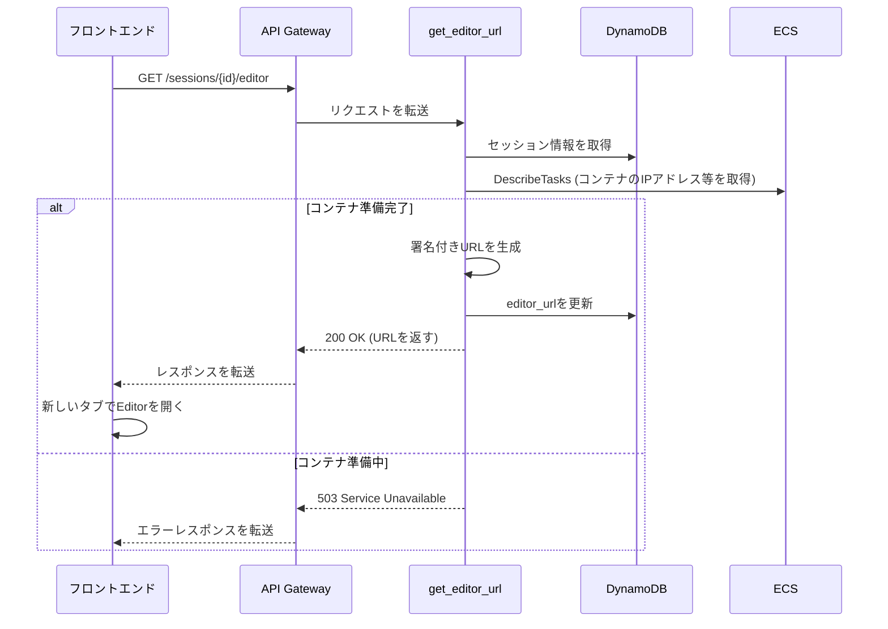

# API詳細設計書: /sessions/{session_id}/editor

## 1. エンドポイント

`GET /sessions/{session_id}/editor`

## 2. 概要

実行中のセッションに対応するWeb Editor (code-server) へのアクセスURLを取得する。
セキュリティのため、URLには有効期限付きの署名（またはトークン）が含まれる。

## 3. リクエスト

### 3.1. パスパラメータ

| 名前 | 型 | 必須 | 説明 |
| :--- | :--- | :--- | :--- |
| `session_id` | String | ○ | 対象のセッションID (UUID v4)。 |

### 3.2. ヘッダー

| 名前 | 型 | 必須 | 説明 |
| :--- | :--- | :--- | :--- |
| `X-API-Key` | String | ○ | 認証用のAPIキー |
| `X-User-ID` | String | ○ | リクエスト元のユーザーを識別するID |

## 4. レスポンス

### 4.1. 成功 (200 OK)

```json
{
  "editor_url": "https://xxx.execute-api.us-east-1.amazonaws.com/editor?token=abc123",
  "expires_at": 1692349200
}
```

| フィールド | 型 | 説明 |
| :--- | :--- | :--- |
| `editor_url` | String | 署名付きのWeb EditorアクセスURL。 |
| `expires_at` | Number | URLの有効期限 (Unix time)。 |

### 4.2. エラーレスポンス

| HTTPステータス | エラーコード | 説明 |
| :--- | :--- | :--- |
| 404 Not Found | `session_not_found` | 指定された`session_id`が存在しない。 |
| 409 Conflict | `session_not_running` | 対象のセッションが `running` 状態ではない。 |
| 503 Service Unavailable | `container_not_ready` | コンテナは起動しているが、Web Editorがまだ利用可能な状態になっていない。 |

## 5. シーケンス図


