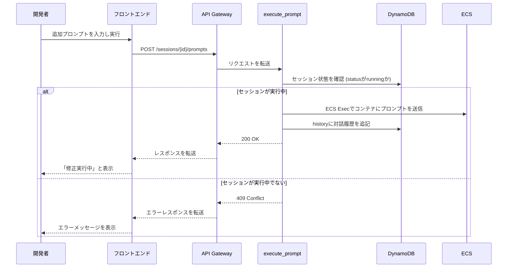

# API詳細設計書: /sessions/{session_id}/prompts

## 1. エンドポイント

`POST /sessions/{session_id}/prompts`

## 2. 概要

進行中のセッションに対して、追加のプロンプトを送信し、さらなるコード編集を指示する。
このAPIは、既に起動しているECSコンテナに対して、`ECS Exec` を通じてコマンドを送信することで実現される想定。

## 3. リクエスト

### 3.1. パスパラメータ

| 名前 | 型 | 必須 | 説明 |
| :--- | :--- | :--- | :--- |
| `session_id` | String | ○ | 対象のセッションID (UUID v4)。 |

### 3.2. ヘッダー

| 名前 | 型 | 必須 | 説明 |
| :--- | :--- | :--- | :--- |
| `Content-Type` | String | ○ | `application/json` |
| `X-API-Key` | String | ○ | 認証用のAPIキー |
| `X-User-ID` | String | ○ | リクエスト元のユーザーを識別するID |

### 3.3. ボディ

```json
{
  "prompt": "先ほど追加したログイン機能にパスワード強度チェックを追加してください"
}
```

| フィールド | 型 | 必須 | 説明 |
| :--- | :--- | :--- | :--- |
| `prompt` | String | ○ | AIにコード編集を指示するための追加プロンプト。1文字以上5000文字以下。 |

## 4. レスポンス

### 4.1. 成功 (200 OK)

プロンプトの受付が成功した場合のレスポンス。処理は非同期で継続される。

```json
{
  "status": "running",
  "message": "プロンプトを実行中です",
  "pr_url": "https://github.com/owner/repo/pull/123"
}
```

| フィールド | 型 | 説明 |
| :--- | :--- | :--- |
| `status` | String | セッションの現在の状態。 |
| `message` | String | ユーザーに表示するためのメッセージ。 |
| `pr_url` | String | 更新対象のPull RequestのURL。 |

### 4.2. エラーレスポンス

| HTTPステータス | エラーコード | 説明 |
| :--- | :--- | :--- |
| 400 Bad Request | `validation_error` | リクエストボディの形式が不正。 |
| 404 Not Found | `session_not_found` | 指定された`session_id`が存在しない。 |
| 409 Conflict | `session_not_running` | 対象のセッションが `running` 状態ではないため、追加の指示を受け付けられない。 |
| 500 Internal Server Error | `internal_error` | サーバー内部で予期せぬエラーが発生した（ECS Execの失敗など）。 |

## 5. シーケンス図


