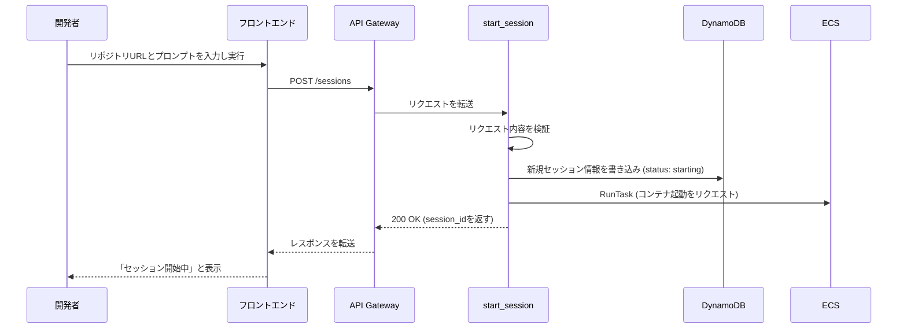

# API詳細設計書: /sessions

## 1. エンドポイント

`POST /sessions`

## 2. 概要

新しい開発セッションを開始する。以下の処理を非同期で実行する。

1.  リクエストを受け付け、セッション情報をDynamoDBに保存する。
2.  指定されたGitHubリポジトリをクローンし、AIによるコード編集を行うためのECSコンテナを起動する。
3.  コンテナ内でコード編集、コミット、プッシュ、Pull Request作成を自動実行する。

## 3. リクエスト

### 3.1. ヘッダー

| 名前 | 型 | 必須 | 説明 |
| :--- | :--- | :--- | :--- |
| `Content-Type` | String | ○ | `application/json` |
| `X-API-Key` | String | ○ | 認証用のAPIキー |
| `X-User-ID` | String | ○ | リクエスト元のユーザーを識別するID |

### 3.2. ボディ

```json
{
  "repository_url": "https://github.com/owner/repo",
  "prompt": "ログイン機能を追加してください。ReactとExpress.jsを使用してください。"
}
```

| フィールド | 型 | 必須 | 説明 |
| :--- | :--- | :--- | :--- |
| `repository_url` | String | ○ | 有効なGitHubリポジトリのURL。正規表現 `^https://github\.com/[\w\-\.]+/[\w\-\.]+$` に一致する必要がある。 |
| `prompt` | String | ○ | AIにコード編集を指示するための初回プロンプト。1文字以上5000文字以下。 |

## 4. レスポンス

### 4.1. 成功 (200 OK)

セッションの受付が成功した場合のレスポンス。処理は非同期で継続される。

```json
{
  "session_id": "550e8400-e29b-41d4-a716-446655440000",
  "status": "starting",
  "message": "セッションを開始しました。コンテナ起動中です。"
}
```

| フィールド | 型 | 説明 |
| :--- | :--- | :--- |
| `session_id` | String | 新しく発行されたセッションの一意なID (UUID v4)。 |
| `status` | String | セッションの現在の状態。この時点では `starting`。 |
| `message` | String | ユーザーに表示するためのメッセージ。 |

### 4.2. エラーレスポンス

| HTTPステータス | エラーコード | 説明 |
| :--- | :--- | :--- |
| 400 Bad Request | `validation_error` | リクエストボディの形式が不正（URLのフォーマットが違う、promptが長すぎるなど）。 |
| 401 Unauthorized | `missing_api_key` | `X-API-Key`ヘッダーが存在しない。 |
| 403 Forbidden | `github_app_not_installed` | 指定されたリポジトリにDevFlow EngineのGitHub Appがインストールされていない。 |
| 429 Too Many Requests | `rate_limit_exceeded` | ユーザーまたはシステム全体で、短時間のセッション作成上限数を超過した。 |
| 500 Internal Server Error | `internal_error` | サーバー内部で予期せぬエラーが発生した。 |

**エラーレスポンスの例 (400 Bad Request):**

```json
{
  "error": "validation_error",
  "message": "repository_url は有効な GitHub URL である必要があります",
  "details": {
    "field": "repository_url",
    "value": "invalid_url"
  },
  "request_id": "req_12345",
  "timestamp": 1692345600
}
```

## 5. シーケンス図


