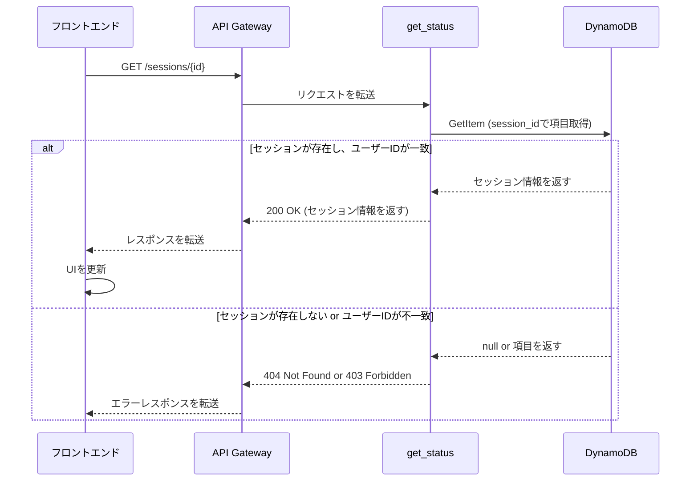

# API詳細設計書: /sessions/{session_id}

## 1. エンドポイント

`GET /sessions/{session_id}`

## 2. 概要

指定されたセッションの現在の状態と、これまでの対話履歴などを取得する。
フロントエンドが定期的にこのAPIをポーリングすることで、UIの状態を更新する。

## 3. リクエスト

### 3.1. パスパラメータ

| 名前 | 型 | 必須 | 説明 |
| :--- | :--- | :--- | :--- |
| `session_id` | String | ○ | 状態を取得したいセッションのID (UUID v4)。 |

### 3.2. ヘッダー

| 名前 | 型 | 必須 | 説明 |
| :--- | :--- | :--- | :--- |
| `X-API-Key` | String | ○ | 認証用のAPIキー |
| `X-User-ID` | String | ○ | リクエスト元のユーザーを識別するID |

## 4. レスポンス

### 4.1. 成功 (200 OK)

```json
{
  "session_id": "550e8400-e29b-41d4-a716-446655440000",
  "status": "running",
  "repository_url": "https://github.com/owner/repo",
  "branch_name": "devflow/session-550e8400",
  "pr_url": "https://github.com/owner/repo/pull/123",
  "editor_url": "https://xxx.execute-api.us-east-1.amazonaws.com/editor",
  "created_at": 1692345600,
  "history": [
    {
      "prompt": "ログイン機能を追加してください",
      "response": "ログイン機能を追加しました。認証にはJWTトークンを使用しています。",
      "timestamp": 1692345700,
      "pr_url": "https://github.com/owner/repo/pull/123"
    }
  ]
}
```

レスポンスボディは、`Session`データモデル全体を含む。
詳細は `data/data_models.md` を参照。

### 4.2. エラーレスポンス

| HTTPステータス | エラーコード | 説明 |
| :--- | :--- | :--- |
| 403 Forbidden | `access_denied` | 指定されたセッションにアクセスする権限がない（`X-User-ID`がセッション作成者と異なる）。 |
| 404 Not Found | `session_not_found` | 指定された`session_id`が存在しない。 |
| 500 Internal Server Error | `internal_error` | サーバー内部で予期せぬエラーが発生した。 |

## 5. シーケンス図


