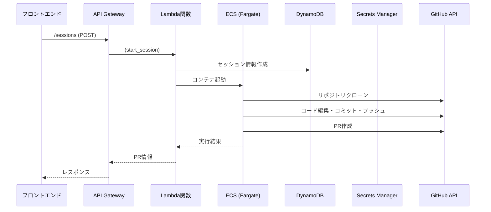

# バックエンド詳細設計書

## 1. 概要

本ドキュメントは「DevFlow Engine」のバックエンドに関する詳細設計を定義する。
バックエンドは、フロントエンドからのリクエストを受け付け、AIによるコード編集、GitHub連携、コンテナ管理などのコア機能を提供する。

- **使用技術:** Python 3.11, FastAPI 0.104, Boto3, Pydantic, pytest
- **インフラストラクチャ:** AWS Lambda, API Gateway, ECS on Fargate, DynamoDB, Secrets Manager, VPC
- **CI/CD:** GitHub Actions, AWS SAM/CDK
- **ログ・監視:** CloudWatch Logs, CloudWatch Metrics, X-Ray (分散トレーシング)

## 2. アーキテクチャ



## 3. API設計

### 3.1. API仕様詳細

#### 3.1.1. エンドポイント一覧

| エンドポイント | HTTPメソッド | Lambda関数 | 概要 | 認証 |
| :--- | :--- | :--- | :--- | :--- |
| `/sessions` | `POST` | `start_session` | 新しいセッションを開始し、PRを自動作成する | API Key |
| `/sessions/{session_id}/prompts` | `POST` | `execute_prompt` | 既存のセッションに追加の修正を指示する | API Key |
| `/sessions/{session_id}` | `GET` | `get_status` | セッションの現在の状態と履歴を取得する | API Key |
| `/sessions/{session_id}/editor` | `GET` | `get_editor_url` | Web EditorへのURLを取得する | API Key |
| `/sessions/{session_id}` | `DELETE` | `stop_session` | セッションを終了し、コンテナを破棄する | API Key |
| `/health` | `GET` | `health_check` | システムヘルスチェック | なし |

#### 3.1.2. API詳細仕様

##### POST /sessions

**概要:** 新しいセッションを開始し、GitHub リポジトリのクローン、AI によるコード編集、PR 作成を実行

**Request Headers:**
```
Content-Type: application/json
X-API-Key: {api_key}
X-User-ID: {user_id} 
```

**Request Body:**
```json
{
  "repository_url": "https://github.com/owner/repo",
  "prompt": "ログイン機能を追加してください。Reactとに Express.js を使用してください。"
}
```

**Response:**
- **200 OK:** セッション開始成功
```json
{
  "session_id": "550e8400-e29b-41d4-a716-446655440000",
  "status": "starting",
  "message": "セッションを開始しました。コンテナ起動中です。"
}
```

- **400 Bad Request:** リクエスト不正
```json
{
  "error": "validation_error",
  "message": "repository_url は有効な GitHub URL である必要があります",
  "details": {
    "field": "repository_url",
    "value": "invalid_url"
  }
}
```

- **403 Forbidden:** GitHub App がインストールされていない
```json
{
  "error": "github_app_not_installed", 
  "message": "指定されたリポジトリに DevFlow App がインストールされていません"
}
```

- **429 Too Many Requests:** レート制限
```json
{
  "error": "rate_limit_exceeded",
  "message": "1時間あたりのセッション作成上限に達しました"
}
```

##### POST /sessions/{session_id}/prompts

**概要:** 既存セッションに追加のプロンプトを送信

**Request Headers:**
```
Content-Type: application/json
X-API-Key: {api_key}
X-User-ID: {user_id}
```

**Request Body:**
```json
{
  "prompt": "先ほど追加したログイン機能にパスワード強度チェックを追加してください"
}
```

**Response:**
- **200 OK:** プロンプト実行成功
```json
{
  "status": "running",
  "message": "プロンプトを実行中です",
  "pr_url": "https://github.com/owner/repo/pull/123"
}
```

- **404 Not Found:** セッションが存在しない
```json
{
  "error": "session_not_found",
  "message": "指定されたセッションが見つかりません"
}
```

- **409 Conflict:** セッションが実行中でない
```json
{
  "error": "session_not_running", 
  "message": "セッションが実行中ではありません",
  "current_status": "stopped"
}
```

##### GET /sessions/{session_id}

**概要:** セッションの現在状態と履歴を取得

**Response:**
- **200 OK:**
```json
{
  "session_id": "550e8400-e29b-41d4-a716-446655440000",
  "status": "running",
  "repository_url": "https://github.com/owner/repo",
  "branch_name": "devflow/session-550e8400",
  "pr_url": "https://github.com/owner/repo/pull/123",
  "editor_url": "https://xxx.execute-api.us-east-1.amazonaws.com/editor",
  "created_at": 1692345600,
  "history": [
    {
      "prompt": "ログイン機能を追加してください",
      "response": "ログイン機能を追加しました。認証にはJWTトークンを使用しています。",
      "timestamp": 1692345700,
      "pr_url": "https://github.com/owner/repo/pull/123"
    }
  ]
}
```

##### GET /sessions/{session_id}/editor

**概要:** Web Editor (code-server) のアクセス URL を取得

**Response:**
- **200 OK:**
```json
{
  "editor_url": "https://xxx.execute-api.us-east-1.amazonaws.com/editor?token=abc123",
  "expires_at": 1692349200
}
```

- **503 Service Unavailable:** コンテナが起動していない
```json
{
  "error": "container_not_ready",
  "message": "コンテナが起動していません"
}
```

##### DELETE /sessions/{session_id}

**概要:** セッションを終了し、関連リソースを削除

**Response:**
- **200 OK:**
```json
{
  "message": "セッションを終了しました"
}
```

#### 3.1.3. エラーハンドリング

**共通エラーレスポンス形式:**
```json
{
  "error": "error_code",
  "message": "人間可読なエラーメッセージ",
  "details": {
    "field": "エラーフィールド",
    "value": "エラー値"
  },
  "request_id": "req_12345",
  "timestamp": 1692345600
}
```

**エラーコード一覧:**
- `validation_error`: リクエストデータの検証エラー
- `github_app_not_installed`: GitHub App がインストールされていない
- `github_api_error`: GitHub API エラー
- `ecs_error`: ECS 操作エラー
- `session_not_found`: セッションが見つからない
- `session_not_running`: セッションが実行中でない
- `container_not_ready`: コンテナが準備中
- `rate_limit_exceeded`: レート制限超過
- `internal_error`: 内部サーバーエラー

### 3.2. データモデル

#### 3.2.1. DynamoDB: `devflow-sessions`テーブル

- **パーティションキー:** `session_id` (string, UUID v4形式)
- **TTL設定:** `ttl` 属性で24時間後に自動削除
- **インデックス:** GSI `user_id-created_at-index` (ユーザー別セッション検索用)

| 属性名 | 型 | 必須 | 説明 | 例 |
| :--- | :--- | :--- | :--- | :--- |
| `session_id` | `S` | ○ | セッションの一意なID (UUID v4) | `"550e8400-e29b-41d4-a716-446655440000"` |
| `user_id` | `S` | ○ | ユーザーの一意なID | `"user_12345"` |
| `repository_url` | `S` | ○ | 対象のGitHubリポジトリURL | `"https://github.com/owner/repo"` |
| `repository_owner` | `S` | ○ | リポジトリオーナー名 | `"owner"` |
| `repository_name` | `S` | ○ | リポジトリ名 | `"repo"` |
| `branch_name` | `S` | ○ | 作業ブランチ名 | `"devflow/session-550e8400"` |
| `ecs_cluster_arn` | `S` | × | ECSクラスターARN | `"arn:aws:ecs:region:account:cluster/devflow"` |
| `ecs_task_arn` | `S` | × | 起動したECSタスクのARN | `"arn:aws:ecs:region:account:task/xxx"` |
| `ecs_task_definition_arn` | `S` | × | ECSタスク定義ARN | `"arn:aws:ecs:region:account:task-definition/devflow:1"` |
| `ecs_service_name` | `S` | × | ECSサービス名 | `"devflow-session-550e8400"` |
| `pr_number` | `N` | × | Pull Request番号 | `123` |
| `pr_url` | `S` | × | 作成されたPull RequestのURL | `"https://github.com/owner/repo/pull/123"` |
| `editor_url` | `S` | × | Code ServerのアクセスURL | `"https://xxx.execute-api.region.amazonaws.com/editor"` |
| `status` | `S` | ○ | セッション状態 | `"starting"`, `"running"`, `"stopped"`, `"error"` |
| `initial_prompt` | `S` | ○ | 初回プロンプト | `"ログイン機能を追加してください"` |
| `history` | `L` | ○ | 対話履歴のリスト | `[{prompt: "...", response: "...", timestamp: 1234567890}]` |
| `github_installation_id` | `N` | ○ | GitHub App インストールID | `12345` |
| `created_at` | `N` | ○ | 作成タイムスタンプ (Unix時間) | `1692345600` |
| `updated_at` | `N` | ○ | 更新タイムスタンプ (Unix時間) | `1692345600` |
| `ttl` | `N` | ○ | TTL (24時間後) | `1692432000` |
| `error_message` | `S` | × | エラーメッセージ (status=errorの場合) | `"ECS task failed to start"` |

#### 3.2.2. Pydanticモデル定義

```python
from typing import List, Optional, Literal
from pydantic import BaseModel, Field
from datetime import datetime
import uuid

class HistoryItem(BaseModel):
    prompt: str
    response: str
    timestamp: int
    pr_url: Optional[str] = None

class SessionStatus(str, Enum):
    STARTING = "starting"
    RUNNING = "running" 
    STOPPED = "stopped"
    ERROR = "error"

class Session(BaseModel):
    session_id: str = Field(default_factory=lambda: str(uuid.uuid4()))
    user_id: str
    repository_url: str
    repository_owner: str
    repository_name: str
    branch_name: str
    ecs_cluster_arn: Optional[str] = None
    ecs_task_arn: Optional[str] = None
    ecs_task_definition_arn: Optional[str] = None
    ecs_service_name: Optional[str] = None
    pr_number: Optional[int] = None
    pr_url: Optional[str] = None
    editor_url: Optional[str] = None
    status: SessionStatus = SessionStatus.STARTING
    initial_prompt: str
    history: List[HistoryItem] = Field(default_factory=list)
    github_installation_id: int
    created_at: int = Field(default_factory=lambda: int(datetime.now().timestamp()))
    updated_at: int = Field(default_factory=lambda: int(datetime.now().timestamp()))
    ttl: int = Field(default_factory=lambda: int(datetime.now().timestamp()) + 86400)  # 24時間
    error_message: Optional[str] = None

# API Request/Response モデル
class StartSessionRequest(BaseModel):
    repository_url: str = Field(..., regex=r'^https://github\.com/[\w\-\.]+/[\w\-\.]+$')
    prompt: str = Field(..., min_length=1, max_length=5000)

class StartSessionResponse(BaseModel):
    session_id: str
    status: SessionStatus
    message: str

class ExecutePromptRequest(BaseModel):
    prompt: str = Field(..., min_length=1, max_length=5000)

class ExecutePromptResponse(BaseModel):
    status: SessionStatus
    message: str
    pr_url: Optional[str] = None
```

## 4. コンテナ設計 (`code-server`)

### 4.1. Docker イメージ仕様

**Dockerfile:**
```dockerfile
FROM codercom/code-server:4.16.1

USER root

# 必要なパッケージのインストール
RUN apt-get update && apt-get install -y \
    git \
    curl \
    wget \
    unzip \
    build-essential \
    python3 \
    python3-pip \
    nodejs \
    npm \
    && rm -rf /var/lib/apt/lists/*

# AWS CLI v2 インストール
RUN curl "https://awscli.amazonaws.com/awscli-exe-linux-x86_64.zip" -o "awscliv2.zip" \
    && unzip awscliv2.zip \
    && ./aws/install \
    && rm -rf awscliv2.zip aws

# GitHub CLI インストール  
RUN curl -fsSL https://cli.github.com/packages/githubcli-archive-keyring.gpg | dd of=/usr/share/keyrings/githubcli-archive-keyring.gpg \
    && chmod go+r /usr/share/keyrings/githubcli-archive-keyring.gpg \
    && echo "deb [arch=$(dpkg --print-architecture) signed-by=/usr/share/keyrings/githubcli-archive-keyring.gpg] https://cli.github.com/packages stable main" | tee /etc/apt/sources.list.d/github-cli.list \
    && apt-get update \
    && apt-get install gh -y

# Claude Code CLI インストール
RUN npm install -g @anthropic-ai/claude-code

# 作業ディレクトリ設定
WORKDIR /workspace

# エントリーポイントスクリプトのコピー
COPY entrypoint.sh /entrypoint.sh
COPY ai-workflow.sh /ai-workflow.sh
RUN chmod +x /entrypoint.sh /ai-workflow.sh

# coder ユーザーに切り替え
USER coder

EXPOSE 8080

ENTRYPOINT ["/entrypoint.sh"]
```

### 4.2. 環境変数設定

| 環境変数名 | 必須 | 説明 | 例 |
| :--- | :--- | :--- | :--- |
| `GITHUB_TOKEN` | ○ | GitHub App アクセストークン | `ghs_abcd1234...` |
| `REPOSITORY_URL` | ○ | クローン対象リポジトリURL | `https://github.com/owner/repo` |
| `BRANCH_NAME` | ○ | 作業ブランチ名 | `devflow/session-550e8400` |
| `INITIAL_PROMPT` | ○ | 初回プロンプト | `ログイン機能を追加` |
| `SESSION_ID` | ○ | セッションID | `550e8400-e29b-41d4-a716-446655440000` |
| `AWS_REGION` | ○ | AWSリージョン | `us-east-1` |
| `DYNAMODB_TABLE` | ○ | DynamoDBテーブル名 | `devflow-sessions` |
| `CLAUDE_API_KEY` | ○ | Claude APIキー | `sk-ant-...` |
| `CODE_SERVER_PASSWORD` | × | Code Serverパスワード | `random_password_123` |

### 4.3. エントリーポイントスクリプト (`entrypoint.sh`)

```bash
#!/bin/bash
set -e

echo "=== DevFlow Engine Container Starting ==="
echo "Session ID: $SESSION_ID"
echo "Repository: $REPOSITORY_URL"
echo "Branch: $BRANCH_NAME"

# GitHub CLI 認証
echo "$GITHUB_TOKEN" | gh auth login --with-token
gh auth status

# リポジトリクローン
echo "Cloning repository..."
REPO_NAME=$(basename "$REPOSITORY_URL" .git)
git clone "$REPOSITORY_URL" "/workspace/$REPO_NAME"
cd "/workspace/$REPO_NAME"

# ブランチ作成・切り替え
echo "Creating and switching to branch: $BRANCH_NAME"
git checkout -b "$BRANCH_NAME"

# Git 設定
git config user.name "DevFlow Engine"
git config user.email "devflow@example.com"

# AI ワークフロー実行（バックグラウンド）
echo "Starting AI workflow..."
/ai-workflow.sh &

# Code Server 起動
echo "Starting code-server..."
exec code-server \
    --bind-addr 0.0.0.0:8080 \
    --disable-telemetry \
    --disable-update-check \
    --auth password \
    "/workspace/$REPO_NAME"
```

### 4.4. AI ワークフロースクリプト (`ai-workflow.sh`)

```bash
#!/bin/bash
set -e

cd "/workspace/$(basename "$REPOSITORY_URL" .git)"

echo "=== Starting AI Workflow ==="
echo "Prompt: $INITIAL_PROMPT"

# セッション状態を「running」に更新
aws dynamodb update-item \
    --table-name "$DYNAMODB_TABLE" \
    --key '{"session_id": {"S": "'$SESSION_ID'"}}' \
    --update-expression "SET #status = :status, updated_at = :timestamp" \
    --expression-attribute-names '{"#status": "status"}' \
    --expression-attribute-values '{":status": {"S": "running"}, ":timestamp": {"N": "'$(date +%s)'"}}' \
    --region "$AWS_REGION"

# Claude Code で AI コード編集実行
echo "Executing AI code editing..."
claude-code --prompt "$INITIAL_PROMPT" --auto-commit --auto-push || {
    echo "AI workflow failed"
    # エラー状態に更新
    aws dynamodb update-item \
        --table-name "$DYNAMODB_TABLE" \
        --key '{"session_id": {"S": "'$SESSION_ID'"}}' \
        --update-expression "SET #status = :status, error_message = :error, updated_at = :timestamp" \
        --expression-attribute-names '{"#status": "status"}' \
        --expression-attribute-values '{":status": {"S": "error"}, ":error": {"S": "AI workflow execution failed"}, ":timestamp": {"N": "'$(date +%s)'"}}' \
        --region "$AWS_REGION"
    exit 1
}

# プルリクエスト作成
echo "Creating pull request..."
PR_URL=$(gh pr create \
    --title "DevFlow: $INITIAL_PROMPT" \
    --body "AI-generated code changes based on prompt: $INITIAL_PROMPT" \
    --base main \
    --head "$BRANCH_NAME" | grep -o 'https://github.com/[^[:space:]]*')

echo "Pull request created: $PR_URL"

# DynamoDB にPR情報を更新
aws dynamodb update-item \
    --table-name "$DYNAMODB_TABLE" \
    --key '{"session_id": {"S": "'$SESSION_ID'"}}' \
    --update-expression "SET pr_url = :pr_url, updated_at = :timestamp, history = list_append(if_not_exists(history, :empty_list), :new_history)" \
    --expression-attribute-values '{
        ":pr_url": {"S": "'$PR_URL'"},
        ":timestamp": {"N": "'$(date +%s)'"},
        ":empty_list": {"L": []},
        ":new_history": {"L": [{"M": {
            "prompt": {"S": "'$INITIAL_PROMPT'"},
            "response": {"S": "AI code editing completed and PR created"},
            "timestamp": {"N": "'$(date +%s)'"},
            "pr_url": {"S": "'$PR_URL'"}
        }}]}
    }' \
    --region "$AWS_REGION"

echo "=== AI Workflow Completed ==="
```

### 4.5. ECS タスク定義

```json
{
  "family": "devflow-code-server",
  "networkMode": "awsvpc",
  "requiresCompatibilities": ["FARGATE"],
  "cpu": "1024",
  "memory": "2048",
  "executionRoleArn": "arn:aws:iam::ACCOUNT:role/ecsTaskExecutionRole",
  "taskRoleArn": "arn:aws:iam::ACCOUNT:role/devflow-task-role",
  "containerDefinitions": [
    {
      "name": "code-server",
      "image": "ACCOUNT.dkr.ecr.REGION.amazonaws.com/devflow-code-server:latest",
      "portMappings": [
        {
          "containerPort": 8080,
          "protocol": "tcp"
        }
      ],
      "essential": true,
      "logConfiguration": {
        "logDriver": "awslogs",
        "options": {
          "awslogs-group": "/ecs/devflow-code-server",
          "awslogs-region": "us-east-1",
          "awslogs-stream-prefix": "ecs"
        }
      },
      "environment": [
        {
          "name": "AWS_DEFAULT_REGION",
          "value": "us-east-1"
        }
      ],
      "secrets": [
        {
          "name": "CLAUDE_API_KEY",
          "valueFrom": "arn:aws:secretsmanager:REGION:ACCOUNT:secret:devflow/claude-api-key"
        }
      ]
    }
  ]
}
```

## 5. 認証・認可

- **GitHub連携:** GitHub Appを利用する。
    - App IDと秘密鍵はAWS Secrets Managerに安全に保管する。
    - Lambda関数やコンテナは、必要なタイミングでSecrets Managerから認証情報を取得し、短命なアクセストークンを生成してGitHub APIを利用する。
- **API Gateway:** (TODO: 必要に応じてAPIキーやIAM認証、Cognitoなどを設定する)

## 5. Lambda関数詳細設計

### 5.1. 共通ライブラリとユーティリティ

```python
# lambda_utils.py
import json
import boto3
import time
import uuid
from typing import Dict, Any, Optional
from pydantic import ValidationError
import logging

logger = logging.getLogger()
logger.setLevel(logging.INFO)

class DevFlowError(Exception):
    def __init__(self, error_code: str, message: str, status_code: int = 500):
        self.error_code = error_code
        self.message = message
        self.status_code = status_code
        super().__init__(message)

def create_response(status_code: int, body: Dict[str, Any], headers: Dict[str, str] = None) -> Dict[str, Any]:
    """標準APIレスポンス形式を作成"""
    default_headers = {
        'Content-Type': 'application/json',
        'Access-Control-Allow-Origin': '*',
        'Access-Control-Allow-Headers': 'Content-Type,X-API-Key,X-User-ID',
        'Access-Control-Allow-Methods': 'GET,POST,PUT,DELETE,OPTIONS'
    }
    if headers:
        default_headers.update(headers)
    
    return {
        'statusCode': status_code,
        'headers': default_headers,
        'body': json.dumps(body, ensure_ascii=False)
    }

def create_error_response(error: DevFlowError, request_id: str) -> Dict[str, Any]:
    """エラーレスポンス作成"""
    body = {
        'error': error.error_code,
        'message': error.message,
        'request_id': request_id,
        'timestamp': int(time.time())
    }
    return create_response(error.status_code, body)

def validate_api_key(event: Dict[str, Any]) -> str:
    """API Key バリデーション"""
    headers = event.get('headers', {})
    api_key = headers.get('X-API-Key') or headers.get('x-api-key')
    if not api_key:
        raise DevFlowError('missing_api_key', 'API Key が必要です', 401)
    # TODO: API Key の検証ロジック
    return api_key

def get_user_id(event: Dict[str, Any]) -> str:
    """ユーザーIDを取得"""
    headers = event.get('headers', {})
    user_id = headers.get('X-User-ID') or headers.get('x-user-id')
    if not user_id:
        raise DevFlowError('missing_user_id', 'User ID が必要です', 401)
    return user_id

# github_client.py
import requests
from datetime import datetime, timedelta
import jwt

class GitHubClient:
    def __init__(self, app_id: str, private_key: str):
        self.app_id = app_id
        self.private_key = private_key
        self.base_url = "https://api.github.com"
    
    def generate_jwt_token(self) -> str:
        """GitHub App JWT トークン生成"""
        now = datetime.utcnow()
        payload = {
            'iat': int(now.timestamp()),
            'exp': int((now + timedelta(minutes=10)).timestamp()),
            'iss': self.app_id
        }
        return jwt.encode(payload, self.private_key, algorithm='RS256')
    
    def get_installation_access_token(self, installation_id: int) -> str:
        """インストールアクセストークン取得"""
        jwt_token = self.generate_jwt_token()
        url = f"{self.base_url}/app/installations/{installation_id}/access_tokens"
        headers = {
            'Authorization': f'Bearer {jwt_token}',
            'Accept': 'application/vnd.github.v3+json'
        }
        response = requests.post(url, headers=headers)
        if response.status_code != 201:
            raise DevFlowError('github_api_error', f'GitHub API エラー: {response.text}', 500)
        return response.json()['token']
    
    def get_installation_id(self, repo_owner: str, repo_name: str) -> int:
        """リポジトリのインストールID取得"""
        jwt_token = self.generate_jwt_token()
        url = f"{self.base_url}/repos/{repo_owner}/{repo_name}/installation"
        headers = {
            'Authorization': f'Bearer {jwt_token}',
            'Accept': 'application/vnd.github.v3+json'
        }
        response = requests.get(url, headers=headers)
        if response.status_code == 404:
            raise DevFlowError('github_app_not_installed', 
                             f'DevFlow App が {repo_owner}/{repo_name} にインストールされていません', 403)
        if response.status_code != 200:
            raise DevFlowError('github_api_error', f'GitHub API エラー: {response.text}', 500)
        return response.json()['id']

# ecs_client.py
class ECSClient:
    def __init__(self):
        self.ecs = boto3.client('ecs')
        self.ec2 = boto3.client('ec2')
    
    def run_task(self, cluster: str, task_definition: str, subnets: list, 
                 security_groups: list, environment: Dict[str, str]) -> str:
        """ECS タスク起動"""
        container_overrides = [{
            'name': 'code-server',
            'environment': [{'name': k, 'value': v} for k, v in environment.items()]
        }]
        
        response = self.ecs.run_task(
            cluster=cluster,
            taskDefinition=task_definition,
            launchType='FARGATE',
            networkConfiguration={
                'awsvpcConfiguration': {
                    'subnets': subnets,
                    'securityGroups': security_groups,
                    'assignPublicIp': 'ENABLED'
                }
            },
            overrides={'containerOverrides': container_overrides}
        )
        
        if response['failures']:
            raise DevFlowError('ecs_error', f'ECS タスク起動失敗: {response["failures"]}', 500)
        
        return response['tasks'][0]['taskArn']
    
    def stop_task(self, cluster: str, task_arn: str):
        """ECS タスク停止"""
        self.ecs.stop_task(cluster=cluster, task=task_arn)
    
    def get_task_ip(self, cluster: str, task_arn: str) -> Optional[str]:
        """タスクのプライベートIPアドレス取得"""
        response = self.ecs.describe_tasks(cluster=cluster, tasks=[task_arn])
        if not response['tasks']:
            return None
        
        task = response['tasks'][0]
        for attachment in task.get('attachments', []):
            if attachment['type'] == 'ElasticNetworkInterface':
                for detail in attachment['details']:
                    if detail['name'] == 'privateIPv4Address':
                        return detail['value']
        return None
```

### 5.2. Lambda関数実装

#### 5.2.1. start_session 関数

```python
# start_session.py
import json
import os
import boto3
from lambda_utils import *
from github_client import GitHubClient
from ecs_client import ECSClient
from models import StartSessionRequest, Session, SessionStatus

def lambda_handler(event, context):
    request_id = context.aws_request_id
    
    try:
        # 認証チェック
        validate_api_key(event)
        user_id = get_user_id(event)
        
        # リクエストボディ解析
        body = json.loads(event['body'])
        request_data = StartSessionRequest(**body)
        
        # リポジトリ情報解析
        repo_parts = request_data.repository_url.replace('https://github.com/', '').split('/')
        repo_owner, repo_name = repo_parts[0], repo_parts[1]
        
        # GitHub App設定取得
        secrets_client = boto3.client('secretsmanager')
        github_secret = secrets_client.get_secret_value(
            SecretId=os.environ['GITHUB_APP_SECRET_ARN']
        )
        github_config = json.loads(github_secret['SecretString'])
        
        # GitHub クライアント初期化
        github_client = GitHubClient(
            app_id=github_config['app_id'],
            private_key=github_config['private_key']
        )
        
        # インストールID取得
        installation_id = github_client.get_installation_id(repo_owner, repo_name)
        
        # アクセストークン生成
        github_token = github_client.get_installation_access_token(installation_id)
        
        # セッション作成
        session = Session(
            user_id=user_id,
            repository_url=request_data.repository_url,
            repository_owner=repo_owner,
            repository_name=repo_name,
            branch_name=f"devflow/session-{session.session_id[:8]}",
            initial_prompt=request_data.prompt,
            github_installation_id=installation_id
        )
        
        # DynamoDB にセッション保存
        dynamodb = boto3.resource('dynamodb')
        table = dynamodb.Table(os.environ['DYNAMODB_TABLE'])
        table.put_item(Item=session.dict())
        
        # ECS タスク起動
        ecs_client = ECSClient()
        environment = {
            'GITHUB_TOKEN': github_token,
            'REPOSITORY_URL': request_data.repository_url,
            'BRANCH_NAME': session.branch_name,
            'INITIAL_PROMPT': request_data.prompt,
            'SESSION_ID': session.session_id,
            'AWS_REGION': os.environ['AWS_REGION'],
            'DYNAMODB_TABLE': os.environ['DYNAMODB_TABLE']
        }
        
        task_arn = ecs_client.run_task(
            cluster=os.environ['ECS_CLUSTER'],
            task_definition=os.environ['ECS_TASK_DEFINITION'],
            subnets=os.environ['ECS_SUBNETS'].split(','),
            security_groups=os.environ['ECS_SECURITY_GROUPS'].split(','),
            environment=environment
        )
        
        # セッションにECS情報を更新
        table.update_item(
            Key={'session_id': session.session_id},
            UpdateExpression='SET ecs_task_arn = :task_arn, ecs_cluster_arn = :cluster',
            ExpressionAttributeValues={
                ':task_arn': task_arn,
                ':cluster': os.environ['ECS_CLUSTER']
            }
        )
        
        return create_response(200, {
            'session_id': session.session_id,
            'status': session.status,
            'message': 'セッションを開始しました。コンテナ起動中です。'
        })
        
    except ValidationError as e:
        error = DevFlowError('validation_error', f'リクエストデータが不正です: {e}', 400)
        return create_error_response(error, request_id)
    except DevFlowError as e:
        return create_error_response(e, request_id)
    except Exception as e:
        logger.error(f"Unexpected error: {str(e)}")
        error = DevFlowError('internal_error', '内部サーバーエラーが発生しました', 500)
        return create_error_response(error, request_id)
```

#### 5.2.2. get_status 関数

```python
# get_status.py
import json
import os
import boto3
from lambda_utils import *

def lambda_handler(event, context):
    request_id = context.aws_request_id
    
    try:
        # 認証チェック
        validate_api_key(event)
        user_id = get_user_id(event)
        
        # セッションID取得
        session_id = event['pathParameters']['session_id']
        
        # DynamoDB からセッション取得
        dynamodb = boto3.resource('dynamodb')
        table = dynamodb.Table(os.environ['DYNAMODB_TABLE'])
        
        response = table.get_item(Key={'session_id': session_id})
        if 'Item' not in response:
            raise DevFlowError('session_not_found', 'セッションが見つかりません', 404)
        
        session = response['Item']
        
        # ユーザー権限チェック
        if session['user_id'] != user_id:
            raise DevFlowError('access_denied', 'アクセスが拒否されました', 403)
        
        # レスポンス作成
        response_data = {
            'session_id': session['session_id'],
            'status': session['status'],
            'repository_url': session['repository_url'],
            'branch_name': session['branch_name'],
            'created_at': session['created_at'],
            'history': session.get('history', [])
        }
        
        # オプショナルフィールド追加
        if 'pr_url' in session:
            response_data['pr_url'] = session['pr_url']
        if 'editor_url' in session:
            response_data['editor_url'] = session['editor_url']
        if 'error_message' in session:
            response_data['error_message'] = session['error_message']
        
        return create_response(200, response_data)
        
    except DevFlowError as e:
        return create_error_response(e, request_id)
    except Exception as e:
        logger.error(f"Unexpected error: {str(e)}")
        error = DevFlowError('internal_error', '内部サーバーエラーが発生しました', 500)
        return create_error_response(error, request_id)
```

## 6. エラーハンドリング

### 6.1. エラー分類と対応

#### 6.1.1. バリデーションエラー
- **発生タイミング:** リクエストデータの検証時
- **対応:** Pydantic でリクエストデータを検証し、詳細なエラーメッセージを返す
- **HTTPステータス:** 400 Bad Request

#### 6.1.2. 認証・認可エラー  
- **発生タイミング:** API Key 検証、ユーザー権限チェック時
- **対応:** 適切なエラーメッセージを返し、機密情報を漏洩させない
- **HTTPステータス:** 401 Unauthorized, 403 Forbidden

#### 6.1.3. GitHub APIエラー
- **発生タイミング:** GitHub App 認証、リポジトリ操作時
- **対応:** レート制限考慮、リトライ機構実装
- **HTTPステータス:** 403 Forbidden (App未インストール), 500 Internal Server Error

#### 6.1.4. AWS リソースエラー
- **発生タイミング:** ECS、DynamoDB、Secrets Manager 操作時  
- **対応:** 適切なIAM権限設定、リソース制限チェック
- **HTTPステータス:** 500 Internal Server Error

### 6.2. ログ出力仕様

```python
import logging
import json

logger = logging.getLogger()
logger.setLevel(logging.INFO)

def log_api_request(event: dict, user_id: str):
    """API リクエストログ"""
    logger.info(json.dumps({
        'event_type': 'api_request',
        'user_id': user_id,
        'method': event['httpMethod'],
        'path': event['path'],
        'timestamp': int(time.time())
    }))

def log_session_created(session: Session):
    """セッション作成ログ"""
    logger.info(json.dumps({
        'event_type': 'session_created',
        'session_id': session.session_id,
        'user_id': session.user_id,
        'repository': f"{session.repository_owner}/{session.repository_name}",
        'timestamp': session.created_at
    }))

def log_error(error: DevFlowError, request_id: str, user_id: str = None):
    """エラーログ"""
    logger.error(json.dumps({
        'event_type': 'error',
        'error_code': error.error_code,
        'message': error.message,
        'request_id': request_id,
        'user_id': user_id,
        'timestamp': int(time.time())
    }))
```

### 6.3. モニタリングとアラート

#### 6.3.1. CloudWatch メトリクス
- Lambda 関数のエラー率、実行時間、メモリ使用量
- DynamoDB の読み書きスループット、スロットリング
- ECS タスクの起動失敗、リソース使用量

#### 6.3.2. アラート設定
- Lambda エラー率 > 5% で SNS 通知
- DynamoDB スロットリング発生で SNS 通知  
- ECS タスク起動失敗で SNS 通知