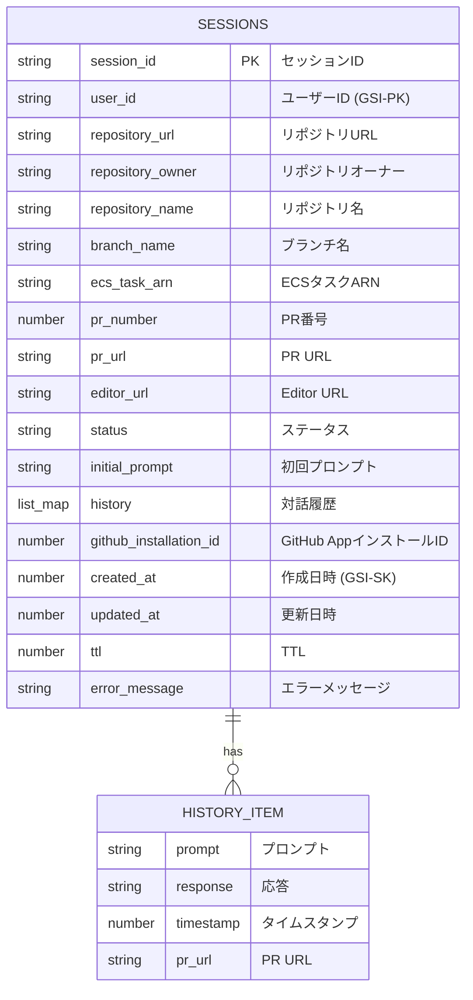

# ER図

## 概要

本ドキュメントは、「DevFlow Engine」のデータモデルをER図で表現する。
DynamoDBのシングルテーブルデザインを採用しているため、エンティティ間のリレーションはテーブル内のアイテムとして表現される。

## ER図 (Mermaid)

## 説明

- **SESSIONSエンティティ:** `devflow-sessions`テーブルの各アイテムを表す。
- **HISTORY_ITEMエンティティ:** `history`属性内の各対話履歴オブジェクトを表す。これは`SESSIONS`エンティティ内にネストされたデータ構造である。
- **リレーション:** `SESSIONS`は複数の`HISTORY_ITEM`を持つことができる (1対多)。
