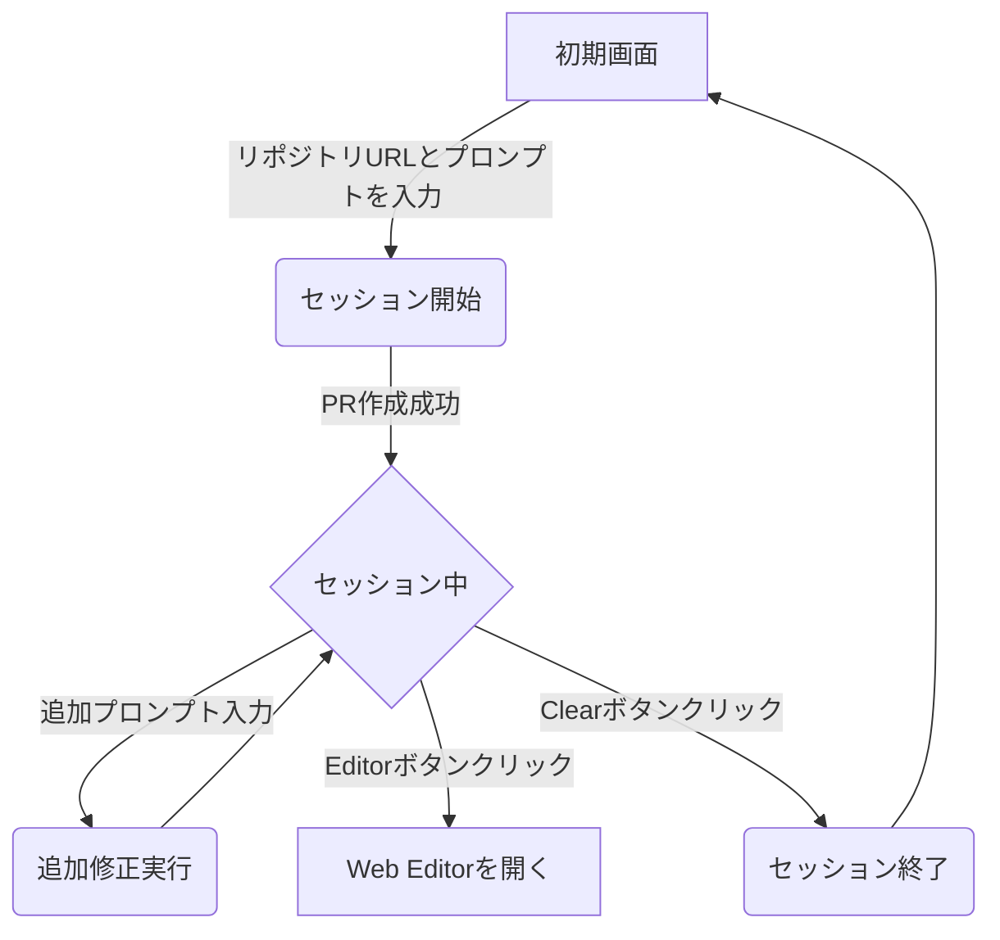

# フロントエンド詳細設計書

## 1. 概要

本ドキュメントは「DevFlow Engine」のフロントエンドに関する詳細設計を定義する。
フロントエンドは、開発者がシステムと対話し、AIによるコード生成とPull Request作成を円滑に行うためのWebインターフェースを提供する。

- **使用技術:** React 18, TypeScript 5.0, Material-UI (MUI) 5.14, Emotion (CSS-in-JS)
- **開発環境:** Node.js 18, Vite 4.4, ESLint, Prettier
- **状態管理:** React Context API, React Query (TanStack Query)
- **HTTP通信:** Axios
- **CI/CD:** GitHub Actions
- **テスト:** Jest, React Testing Library, Playwright (E2E)

## 2. 画面設計

### 2.1. 画面構成

本システムのUIは、単一のページで構成され、以下の主要コンポーネントから成る。

| コンポーネントID | コンポーネント名 | 概要 |
| :--- | :--- | :--- |
| `Header` | ヘッダー | アプリケーションのタイトルと、必要に応じてユーザー情報を表示する。 |
| `SessionPanel` | セッション管理パネル | GitHubリポジトリURLと初回プロンプトを入力し、セッションを開始する。 |
| `HistoryPanel` | 履歴表示パネル | 実行されたプロンプト、生成されたPRコメント、GitHubへのリンクを時系列で表示する。 |
| `PromptPanel` | プロンプト入力パネル | 進行中のセッションに対して、追加のプロンプトを入力・送信する。 |
| `ActionBar` | アクションバー | Web Editorへのアクセスやセッション終了などのアクションボタンを配置する。 |

### 2.2. 画面遷移図



### 2.3. コンポーネント詳細実装

#### 2.3.1. SessionPanel コンポーネント

```typescript
// components/SessionPanel/SessionPanel.tsx
import React, { useState } from 'react';
import {
  Box,
  TextField,
  Button,
  Typography,
  Paper,
  CircularProgress,
  Alert
} from '@mui/material';
import { GitHub, PlayArrow } from '@mui/icons-material';
import { useStartSession } from '../../hooks/useSessionApi';
import { useSession } from '../../contexts/SessionContext';

interface SessionPanelProps {
  disabled?: boolean;
}

export const SessionPanel: React.FC<SessionPanelProps> = ({ disabled = false }) => {
  const [repositoryUrl, setRepositoryUrl] = useState('');
  const [initialPrompt, setInitialPrompt] = useState('');
  const [errors, setErrors] = useState<{ [key: string]: string }>({});
  
  const { state } = useSession();
  const startSessionMutation = useStartSession();

  const validateForm = (): boolean => {
    const newErrors: { [key: string]: string } = {};
    
    if (!repositoryUrl.trim()) {
      newErrors.repositoryUrl = 'GitHubリポジトリURLを入力してください';
    } else if (!/^https:\/\/github\.com\/[\w\-\.]+\/[\w\-\.]+$/.test(repositoryUrl)) {
      newErrors.repositoryUrl = '有効なGitHubリポジトリURLを入力してください';
    }
    
    if (!initialPrompt.trim()) {
      newErrors.initialPrompt = 'プロンプトを入力してください';
    } else if (initialPrompt.length > 5000) {
      newErrors.initialPrompt = 'プロンプトは5000文字以内で入力してください';
    }
    
    setErrors(newErrors);
    return Object.keys(newErrors).length === 0;
  };

  const handleSubmit = (e: React.FormEvent) => {
    e.preventDefault();
    if (!validateForm()) return;
    
    startSessionMutation.mutate({
      repositoryUrl: repositoryUrl.trim(),
      prompt: initialPrompt.trim()
    });
  };

  const isLoading = startSessionMutation.isPending || state.isLoading;
  const hasSession = !!state.currentSession;

  return (
    <Paper elevation={2} sx={{ p: 3, mb: 2 }}>
      <Typography variant="h6" gutterBottom sx={{ display: 'flex', alignItems: 'center' }}>
        <GitHub sx={{ mr: 1 }} />
        新しいセッションを開始
      </Typography>
      
      {state.error && (
        <Alert severity="error" sx={{ mb: 2 }}>
          {state.error}
        </Alert>
      )}

      <form onSubmit={handleSubmit}>
        <TextField
          fullWidth
          label="GitHubリポジトリURL"
          placeholder="https://github.com/owner/repository"
          value={repositoryUrl}
          onChange={(e) => setRepositoryUrl(e.target.value)}
          error={!!errors.repositoryUrl}
          helperText={errors.repositoryUrl}
          disabled={disabled || hasSession || isLoading}
          sx={{ mb: 2 }}
          InputProps={{
            startAdornment: <GitHub sx={{ mr: 1, color: 'text.secondary' }} />
          }}
        />

        <TextField
          fullWidth
          multiline
          rows={4}
          label="初回プロンプト"
          placeholder="例: ログイン機能を追加してください。ReactとExpress.jsを使用してください。"
          value={initialPrompt}
          onChange={(e) => setInitialPrompt(e.target.value)}
          error={!!errors.initialPrompt}
          helperText={errors.initialPrompt || `${initialPrompt.length}/5000文字`}
          disabled={disabled || hasSession || isLoading}
          sx={{ mb: 3 }}
        />

        <Button
          type="submit"
          variant="contained"
          size="large"
          disabled={disabled || hasSession || isLoading}
          startIcon={isLoading ? <CircularProgress size={20} /> : <PlayArrow />}
          fullWidth
        >
          {isLoading ? 'セッション開始中...' : 'セッション開始'}
        </Button>
      </form>
    </Paper>
  );
};
```

#### 2.3.2. HistoryPanel コンポーネント

```typescript
// components/HistoryPanel/HistoryPanel.tsx
import React from 'react';
import {
  Box,
  Typography,
  Paper,
  Timeline,
  TimelineItem,
  TimelineSeparator,
  TimelineConnector,
  TimelineContent,
  TimelineDot,
  Chip,
  Link,
  Alert
} from '@mui/material';
import {
  Code,
  PullRequest,
  CheckCircle,
  Error as ErrorIcon,
  Schedule
} from '@mui/icons-material';
import { formatDistanceToNow } from 'date-fns';
import { ja } from 'date-fns/locale';
import { useSession } from '../../contexts/SessionContext';
import { SessionStatus } from '../../types/session';

export const HistoryPanel: React.FC = () => {
  const { state } = useSession();
  const session = state.currentSession;

  if (!session) {
    return (
      <Paper elevation={2} sx={{ p: 3, textAlign: 'center' }}>
        <Typography variant="body1" color="text.secondary">
          セッションが開始されていません
        </Typography>
      </Paper>
    );
  }

  const getStatusColor = (status: SessionStatus) => {
    switch (status) {
      case SessionStatus.RUNNING: return 'primary';
      case SessionStatus.STOPPED: return 'default';
      case SessionStatus.ERROR: return 'error';
      default: return 'warning';
    }
  };

  const getStatusIcon = (status: SessionStatus) => {
    switch (status) {
      case SessionStatus.RUNNING: return <Schedule />;
      case SessionStatus.STOPPED: return <CheckCircle />;
      case SessionStatus.ERROR: return <ErrorIcon />;
      default: return <Schedule />;
    }
  };

  return (
    <Paper elevation={2} sx={{ p: 3 }}>
      <Box sx={{ display: 'flex', justifyContent: 'space-between', alignItems: 'center', mb: 2 }}>
        <Typography variant="h6">実行履歴</Typography>
        <Chip
          label={session.status}
          color={getStatusColor(session.status)}
          icon={getStatusIcon(session.status)}
          size="small"
        />
      </Box>

      {session.pr_url && (
        <Alert severity="success" sx={{ mb: 2 }}>
          <Typography variant="body2">
            プルリクエストが作成されました:{' '}
            <Link href={session.pr_url} target="_blank" rel="noopener">
              {session.pr_url}
            </Link>
          </Typography>
        </Alert>
      )}

      {session.error_message && (
        <Alert severity="error" sx={{ mb: 2 }}>
          {session.error_message}
        </Alert>
      )}

      <Timeline>
        {session.history.map((item, index) => (
          <TimelineItem key={index}>
            <TimelineSeparator>
              <TimelineDot color="primary">
                <Code />
              </TimelineDot>
              {index < session.history.length - 1 && <TimelineConnector />}
            </TimelineSeparator>
            <TimelineContent>
              <Typography variant="body2" color="text.secondary">
                {formatDistanceToNow(new Date(item.timestamp * 1000), {
                  addSuffix: true,
                  locale: ja
                })}
              </Typography>
              <Typography variant="body1" sx={{ fontWeight: 'bold', mb: 1 }}>
                プロンプト: {item.prompt}
              </Typography>
              <Typography variant="body2" sx={{ mb: 1 }}>
                レスポンス: {item.response}
              </Typography>
              {item.pr_url && (
                <Link href={item.pr_url} target="_blank" rel="noopener">
                  <Chip
                    label="PRを表示"
                    size="small"
                    icon={<PullRequest />}
                    clickable
                  />
                </Link>
              )}
            </TimelineContent>
          </TimelineItem>
        ))}
      </Timeline>

      {session.history.length === 0 && (
        <Typography variant="body2" color="text.secondary" textAlign="center">
          まだ履歴がありません
        </Typography>
      )}
    </Paper>
  );
};
```

#### 2.3.3. PromptPanel コンポーネント

```typescript
// components/PromptPanel/PromptPanel.tsx
import React, { useState } from 'react';
import {
  Box,
  TextField,
  Button,
  Typography,
  Paper,
  CircularProgress,
  Alert
} from '@mui/material';
import { Send, Add } from '@mui/icons-material';
import { useExecutePrompt } from '../../hooks/useSessionApi';
import { useSession } from '../../contexts/SessionContext';
import { SessionStatus } from '../../types/session';

export const PromptPanel: React.FC = () => {
  const [prompt, setPrompt] = useState('');
  const [error, setError] = useState('');
  
  const { state } = useSession();
  const executePromptMutation = useExecutePrompt();

  const session = state.currentSession;
  const isSessionActive = session && [SessionStatus.RUNNING, SessionStatus.STARTING].includes(session.status);
  const isLoading = executePromptMutation.isPending;

  const validatePrompt = (): boolean => {
    if (!prompt.trim()) {
      setError('プロンプトを入力してください');
      return false;
    }
    if (prompt.length > 5000) {
      setError('プロンプトは5000文字以内で入力してください');
      return false;
    }
    setError('');
    return true;
  };

  const handleSubmit = (e: React.FormEvent) => {
    e.preventDefault();
    if (!validatePrompt()) return;
    
    executePromptMutation.mutate(prompt.trim(), {
      onSuccess: () => {
        setPrompt('');
      }
    });
  };

  if (!session) {
    return (
      <Paper elevation={2} sx={{ p: 3, textAlign: 'center' }}>
        <Typography variant="body1" color="text.secondary">
          セッションを開始してからプロンプトを入力してください
        </Typography>
      </Paper>
    );
  }

  return (
    <Paper elevation={2} sx={{ p: 3 }}>
      <Typography variant="h6" gutterBottom sx={{ display: 'flex', alignItems: 'center' }}>
        <Add sx={{ mr: 1 }} />
        追加プロンプト
      </Typography>

      {!isSessionActive && (
        <Alert severity="warning" sx={{ mb: 2 }}>
          セッションが実行中ではありません。新しいプロンプトを実行できません。
        </Alert>
      )}

      <form onSubmit={handleSubmit}>
        <TextField
          fullWidth
          multiline
          rows={3}
          label="追加プロンプト"
          placeholder="例: 先ほど追加したログイン機能にパスワード強度チェックを追加してください"
          value={prompt}
          onChange={(e) => setPrompt(e.target.value)}
          error={!!error}
          helperText={error || `${prompt.length}/5000文字`}
          disabled={!isSessionActive || isLoading}
          sx={{ mb: 2 }}
        />

        <Button
          type="submit"
          variant="contained"
          disabled={!isSessionActive || isLoading}
          startIcon={isLoading ? <CircularProgress size={20} /> : <Send />}
          fullWidth
        >
          {isLoading ? '実行中...' : 'プロンプト実行'}
        </Button>
      </form>
    </Paper>
  );
};
```

#### 2.3.4. ActionBar コンポーネント

```typescript
// components/ActionBar/ActionBar.tsx
import React from 'react';
import {
  Box,
  Button,
  Paper,
  Tooltip,
  CircularProgress
} from '@mui/material';
import { Code, Stop, Launch } from '@mui/icons-material';
import { useSession } from '../../contexts/SessionContext';
import { useStopSession } from '../../hooks/useSessionApi';
import { apiClient } from '../../services/api';
import { SessionStatus } from '../../types/session';

export const ActionBar: React.FC = () => {
  const { state } = useSession();
  const stopSessionMutation = useStopSession();
  
  const session = state.currentSession;
  const isSessionActive = session && session.status === SessionStatus.RUNNING;

  const handleOpenEditor = async () => {
    if (!session) return;
    
    try {
      const data = await apiClient.getEditorUrl(session.session_id);
      window.open(data.editor_url, '_blank', 'noopener,noreferrer');
    } catch (error) {
      console.error('Editor URL取得エラー:', error);
    }
  };

  const handleStopSession = () => {
    if (window.confirm('セッションを終了しますか？この操作は取り消せません。')) {
      stopSessionMutation.mutate();
    }
  };

  if (!session) {
    return null;
  }

  return (
    <Paper elevation={2} sx={{ p: 2 }}>
      <Box sx={{ display: 'flex', gap: 2, justifyContent: 'center' }}>
        <Tooltip title="Web EditorでコードをViewl編集">
          <Button
            variant="outlined"
            startIcon={<Code />}
            onClick={handleOpenEditor}
            disabled={!isSessionActive}
          >
            Web Editor
          </Button>
        </Tooltip>

        <Tooltip title="リポジトリをGitHubで表示">
          <Button
            variant="outlined"
            startIcon={<Launch />}
            onClick={() => window.open(session.repository_url, '_blank')}
          >
            GitHub
          </Button>
        </Tooltip>

        <Tooltip title="セッションを終了し、コンテナを破棄">
          <Button
            variant="outlined"
            color="error"
            startIcon={stopSessionMutation.isPending ? <CircularProgress size={20} /> : <Stop />}
            onClick={handleStopSession}
            disabled={stopSessionMutation.isPending}
          >
            セッション終了
          </Button>
        </Tooltip>
      </Box>
    </Paper>
  );
};
```

## 5. メインアプリケーション

### 5.1. App.tsx 実装

```typescript
// App.tsx
import React from 'react';
import {
  ThemeProvider,
  createTheme,
  CssBaseline,
  Container,
  AppBar,
  Toolbar,
  Typography,
  Box,
  Grid
} from '@mui/material';
import { QueryClient, QueryClientProvider } from '@tanstack/react-query';
import { SnackbarProvider } from 'notistack';
import { SessionProvider } from './contexts/SessionContext';
import { SessionPanel } from './components/SessionPanel/SessionPanel';
import { HistoryPanel } from './components/HistoryPanel/HistoryPanel';
import { PromptPanel } from './components/PromptPanel/PromptPanel';
import { ActionBar } from './components/ActionBar/ActionBar';
import { DevFlow } from '@mui/icons-material';

const theme = createTheme({
  palette: {
    mode: 'light',
    primary: {
      main: '#2196f3'
    },
    secondary: {
      main: '#ff9800'
    }
  },
  typography: {
    h4: {
      fontWeight: 'bold'
    }
  }
});

const queryClient = new QueryClient({
  defaultOptions: {
    queries: {
      retry: 3,
      retryDelay: attemptIndex => Math.min(1000 * 2 ** attemptIndex, 30000),
      staleTime: 5 * 60 * 1000, // 5分
    },
  },
});

const App: React.FC = () => {
  return (
    <QueryClientProvider client={queryClient}>
      <ThemeProvider theme={theme}>
        <CssBaseline />
        <SnackbarProvider 
          maxSnack={3}
          anchorOrigin={{
            vertical: 'bottom',
            horizontal: 'right'
          }}
        >
          <SessionProvider>
            <AppBar position="static" elevation={1}>
              <Toolbar>
                <DevFlow sx={{ mr: 2 }} />
                <Typography variant="h6" component="div" sx={{ flexGrow: 1 }}>
                  DevFlow Engine
                </Typography>
                <Typography variant="subtitle2" color="inherit">
                  AI-Powered Development Automation
                </Typography>
              </Toolbar>
            </AppBar>

            <Container maxWidth="xl" sx={{ mt: 4, mb: 4 }}>
              <Grid container spacing={3}>
                {/* セッション開始パネル */}
                <Grid item xs={12} md={6}>
                  <SessionPanel />
                </Grid>

                {/* アクションバー */}
                <Grid item xs={12} md={6}>
                  <ActionBar />
                </Grid>

                {/* 履歴表示パネル */}
                <Grid item xs={12} md={8}>
                  <HistoryPanel />
                </Grid>

                {/* 追加プロンプトパネル */}
                <Grid item xs={12} md={4}>
                  <PromptPanel />
                </Grid>
              </Grid>
            </Container>
          </SessionProvider>
        </SnackbarProvider>
      </ThemeProvider>
    </QueryClientProvider>
  );
};

export default App;
```

### 5.2. 環境設定

```typescript
// .env.example
REACT_APP_API_BASE_URL=https://api.devflow.example.com
REACT_APP_API_KEY=your_api_key_here
REACT_APP_USER_ID=your_user_id_here
REACT_APP_VERSION=1.0.0

// constants/config.ts
export const CONFIG = {
  API_BASE_URL: process.env.REACT_APP_API_BASE_URL || 'https://api.devflow.example.com/v1',
  API_KEY: process.env.REACT_APP_API_KEY || '',
  USER_ID: process.env.REACT_APP_USER_ID || 'default_user',
  VERSION: process.env.REACT_APP_VERSION || '1.0.0',
  
  // ポーリング間隔設定
  POLLING_INTERVALS: {
    SESSION_STATUS: 5000, // 5秒
    RUNNING_SESSION: 3000, // 3秒
  },
  
  // UI設定
  MAX_PROMPT_LENGTH: 5000,
  SNACKBAR_AUTO_HIDE_DURATION: 6000,
} as const;
```

## 6. テスト仕様

### 6.1. ユニットテスト

```typescript
// __tests__/components/SessionPanel.test.tsx
import React from 'react';
import { render, screen, fireEvent, waitFor } from '@testing-library/react';
import userEvent from '@testing-library/user-event';
import { QueryClient, QueryClientProvider } from '@tanstack/react-query';
import { SessionProvider } from '../../contexts/SessionContext';
import { SessionPanel } from '../../components/SessionPanel/SessionPanel';

const createWrapper = () => {
  const queryClient = new QueryClient({
    defaultOptions: { queries: { retry: false }, mutations: { retry: false } }
  });
  
  return ({ children }: { children: React.ReactNode }) => (
    <QueryClientProvider client={queryClient}>
      <SessionProvider>
        {children}
      </SessionProvider>
    </QueryClientProvider>
  );
};

describe('SessionPanel', () => {
  test('正常なフォーム入力でセッションが開始される', async () => {
    const user = userEvent.setup();
    render(<SessionPanel />, { wrapper: createWrapper() });

    const urlInput = screen.getByLabelText('GitHubリポジトリURL');
    const promptInput = screen.getByLabelText('初回プロンプト');
    const submitButton = screen.getByRole('button', { name: 'セッション開始' });

    await user.type(urlInput, 'https://github.com/owner/repo');
    await user.type(promptInput, 'ログイン機能を追加してください');
    await user.click(submitButton);

    await waitFor(() => {
      expect(screen.getByText('セッション開始中...')).toBeInTheDocument();
    });
  });

  test('無効なGitHub URLでバリデーションエラーが表示される', async () => {
    const user = userEvent.setup();
    render(<SessionPanel />, { wrapper: createWrapper() });

    const urlInput = screen.getByLabelText('GitHubリポジトリURL');
    const submitButton = screen.getByRole('button', { name: 'セッション開始' });

    await user.type(urlInput, 'invalid-url');
    await user.click(submitButton);

    await waitFor(() => {
      expect(screen.getByText('有効なGitHubリポジトリURLを入力してください')).toBeInTheDocument();
    });
  });

  test('プロンプトが空の場合にバリデーションエラーが表示される', async () => {
    const user = userEvent.setup();
    render(<SessionPanel />, { wrapper: createWrapper() });

    const urlInput = screen.getByLabelText('GitHubリポジトリURL');
    const submitButton = screen.getByRole('button', { name: 'セッション開始' });

    await user.type(urlInput, 'https://github.com/owner/repo');
    await user.click(submitButton);

    await waitFor(() => {
      expect(screen.getByText('プロンプトを入力してください')).toBeInTheDocument();
    });
  });
});
```

### 6.2. 統合テスト

```typescript
// __tests__/integration/session-flow.test.tsx
import React from 'react';
import { render, screen, waitFor } from '@testing-library/react';
import userEvent from '@testing-library/user-event';
import { rest } from 'msw';
import { setupServer } from 'msw/node';
import App from '../../App';

const server = setupServer(
  rest.post('/sessions', (req, res, ctx) => {
    return res(ctx.json({
      session_id: 'test-session-id',
      status: 'starting',
      message: 'セッションを開始しました'
    }));
  }),

  rest.get('/sessions/:sessionId', (req, res, ctx) => {
    return res(ctx.json({
      session_id: 'test-session-id',
      status: 'running',
      repository_url: 'https://github.com/owner/repo',
      branch_name: 'devflow/session-test',
      created_at: Date.now(),
      history: [],
      pr_url: 'https://github.com/owner/repo/pull/123'
    }));
  }),

  rest.post('/sessions/:sessionId/prompts', (req, res, ctx) => {
    return res(ctx.json({
      status: 'running',
      message: 'プロンプトを実行中です',
      pr_url: 'https://github.com/owner/repo/pull/123'
    }));
  })
);

beforeAll(() => server.listen());
afterEach(() => server.resetHandlers());
afterAll(() => server.close());

describe('Session Flow Integration Test', () => {
  test('完全なセッションフローが正常に動作する', async () => {
    const user = userEvent.setup();
    render(<App />);

    // セッション開始
    const urlInput = screen.getByLabelText('GitHubリポジトリURL');
    const promptInput = screen.getByLabelText('初回プロンプト');
    const startButton = screen.getByRole('button', { name: 'セッション開始' });

    await user.type(urlInput, 'https://github.com/owner/repo');
    await user.type(promptInput, 'ログイン機能を追加してください');
    await user.click(startButton);

    // セッション開始の確認
    await waitFor(() => {
      expect(screen.getByText('セッション開始中...')).toBeInTheDocument();
    });

    // セッション状態の更新を待つ
    await waitFor(() => {
      expect(screen.getByText('running')).toBeInTheDocument();
    }, { timeout: 10000 });

    // 追加プロンプトの実行
    const additionalPrompt = screen.getByLabelText('追加プロンプト');
    const executeButton = screen.getByRole('button', { name: 'プロンプト実行' });

    await user.type(additionalPrompt, 'パスワード強度チェックを追加してください');
    await user.click(executeButton);

    await waitFor(() => {
      expect(screen.getByText('実行中...')).toBeInTheDocument();
    });
  });
});
```

### 6.3. E2Eテスト (Playwright)

```typescript
// e2e/session-management.spec.ts
import { test, expect } from '@playwright/test';

test.describe('DevFlow Engine E2E Tests', () => {
  test.beforeEach(async ({ page }) => {
    await page.goto('/');
  });

  test('新しいセッションを開始してPRを作成する', async ({ page }) => {
    // セッション開始フォームを入力
    await page.fill('[data-testid="repository-url-input"]', 'https://github.com/test/repo');
    await page.fill('[data-testid="initial-prompt-input"]', 'Add login functionality');
    
    // セッション開始ボタンをクリック
    await page.click('[data-testid="start-session-button"]');
    
    // ローディング状態を確認
    await expect(page.locator('text=セッション開始中...')).toBeVisible();
    
    // セッション開始完了を待つ
    await expect(page.locator('[data-testid="session-status"]')).toContainText('running', { timeout: 30000 });
    
    // PRリンクが表示されることを確認
    await expect(page.locator('[data-testid="pr-link"]')).toBeVisible({ timeout: 60000 });
    
    // Web Editorボタンが有効になることを確認
    await expect(page.locator('[data-testid="web-editor-button"]')).toBeEnabled();
  });

  test('追加プロンプトを実行する', async ({ page }) => {
    // 事前条件: セッションが開始されている状態
    await page.fill('[data-testid="repository-url-input"]', 'https://github.com/test/repo');
    await page.fill('[data-testid="initial-prompt-input"]', 'Add login functionality');
    await page.click('[data-testid="start-session-button"]');
    
    await expect(page.locator('[data-testid="session-status"]')).toContainText('running', { timeout: 30000 });
    
    // 追加プロンプトを入力
    await page.fill('[data-testid="additional-prompt-input"]', 'Add password strength validation');
    await page.click('[data-testid="execute-prompt-button"]');
    
    // 実行中状態を確認
    await expect(page.locator('text=実行中...')).toBeVisible();
    
    // 履歴に新しいアイテムが追加されることを確認
    await expect(page.locator('[data-testid="history-item"]').nth(1)).toBeVisible({ timeout: 30000 });
  });

  test('セッションを終了する', async ({ page }) => {
    // セッション開始
    await page.fill('[data-testid="repository-url-input"]', 'https://github.com/test/repo');
    await page.fill('[data-testid="initial-prompt-input"]', 'Add login functionality');
    await page.click('[data-testid="start-session-button"]');
    
    await expect(page.locator('[data-testid="session-status"]')).toContainText('running', { timeout: 30000 });
    
    // セッション終了ボタンをクリック
    await page.click('[data-testid="stop-session-button"]');
    
    // 確認ダイアログでOKをクリック
    await page.click('text=OK');
    
    // セッションがクリアされることを確認
    await expect(page.locator('[data-testid="start-session-button"]')).toBeEnabled();
    await expect(page.locator('[data-testid="session-status"]')).not.toBeVisible();
  });
});
```

## 7. ビルド・デプロイ設定

### 7.1. package.json

```json
{
  "name": "devflow-engine-frontend",
  "version": "1.0.0",
  "scripts": {
    "dev": "vite",
    "build": "tsc && vite build",
    "preview": "vite preview",
    "test": "jest",
    "test:watch": "jest --watch",
    "test:coverage": "jest --coverage",
    "e2e": "playwright test",
    "e2e:ui": "playwright test --ui",
    "lint": "eslint src --ext ts,tsx --report-unused-disable-directives --max-warnings 0",
    "lint:fix": "eslint src --ext ts,tsx --fix",
    "type-check": "tsc --noEmit"
  },
  "dependencies": {
    "react": "^18.2.0",
    "react-dom": "^18.2.0",
    "@mui/material": "^5.14.0",
    "@mui/icons-material": "^5.14.0",
    "@emotion/react": "^11.11.0",
    "@emotion/styled": "^11.11.0",
    "@tanstack/react-query": "^4.29.0",
    "axios": "^1.4.0",
    "notistack": "^3.0.0",
    "date-fns": "^2.30.0"
  },
  "devDependencies": {
    "@types/react": "^18.2.0",
    "@types/react-dom": "^18.2.0",
    "@vitejs/plugin-react": "^4.0.0",
    "vite": "^4.4.0",
    "typescript": "^5.0.0",
    "jest": "^29.5.0",
    "@testing-library/react": "^13.4.0",
    "@testing-library/jest-dom": "^5.16.0",
    "@testing-library/user-event": "^14.4.0",
    "@playwright/test": "^1.36.0",
    "msw": "^1.2.0",
    "eslint": "^8.45.0",
    "@typescript-eslint/eslint-plugin": "^6.0.0",
    "@typescript-eslint/parser": "^6.0.0",
    "prettier": "^3.0.0"
  }
}
```

## 4. 詳細技術仕様

### 4.1. プロジェクト構成

```
src/
├── components/          # 再利用可能コンポーネント
│   ├── common/         # 共通コンポーネント
│   ├── SessionPanel/   # セッション管理パネル
│   ├── HistoryPanel/   # 履歴表示パネル
│   ├── PromptPanel/    # プロンプト入力パネル
│   └── ActionBar/      # アクションバー
├── contexts/           # React Context
├── hooks/              # カスタムフック
├── services/           # API通信
├── types/              # TypeScript型定義
├── utils/              # ユーティリティ関数
├── constants/          # 定数定義
└── __tests__/          # テストファイル
```

### 4.2. 状態管理設計

#### 4.2.1. セッション状態管理

```typescript
// types/session.ts
export interface HistoryItem {
  prompt: string;
  response: string;
  timestamp: number;
  pr_url?: string;
}

export enum SessionStatus {
  STARTING = 'starting',
  RUNNING = 'running',
  STOPPED = 'stopped',
  ERROR = 'error'
}

export interface Session {
  session_id: string;
  status: SessionStatus;
  repository_url: string;
  branch_name: string;
  pr_url?: string;
  editor_url?: string;
  created_at: number;
  history: HistoryItem[];
  error_message?: string;
}

export interface SessionState {
  currentSession: Session | null;
  isLoading: boolean;
  error: string | null;
}

// contexts/SessionContext.tsx
import React, { createContext, useContext, useReducer, ReactNode } from 'react';
import { Session, SessionState, SessionStatus } from '../types/session';

type SessionAction = 
  | { type: 'START_SESSION' }
  | { type: 'SESSION_STARTED'; payload: Session }
  | { type: 'SESSION_UPDATED'; payload: Partial<Session> }
  | { type: 'SESSION_ERROR'; payload: string }
  | { type: 'CLEAR_SESSION' }
  | { type: 'CLEAR_ERROR' };

const initialState: SessionState = {
  currentSession: null,
  isLoading: false,
  error: null
};

const sessionReducer = (state: SessionState, action: SessionAction): SessionState => {
  switch (action.type) {
    case 'START_SESSION':
      return { ...state, isLoading: true, error: null };
    case 'SESSION_STARTED':
      return { ...state, currentSession: action.payload, isLoading: false };
    case 'SESSION_UPDATED':
      return {
        ...state,
        currentSession: state.currentSession ? 
          { ...state.currentSession, ...action.payload } : null
      };
    case 'SESSION_ERROR':
      return { ...state, error: action.payload, isLoading: false };
    case 'CLEAR_SESSION':
      return { ...state, currentSession: null, isLoading: false };
    case 'CLEAR_ERROR':
      return { ...state, error: null };
    default:
      return state;
  }
};

interface SessionContextType {
  state: SessionState;
  dispatch: React.Dispatch<SessionAction>;
}

const SessionContext = createContext<SessionContextType | undefined>(undefined);

export const SessionProvider: React.FC<{ children: ReactNode }> = ({ children }) => {
  const [state, dispatch] = useReducer(sessionReducer, initialState);
  
  return (
    <SessionContext.Provider value={{ state, dispatch }}>
      {children}
    </SessionContext.Provider>
  );
};

export const useSession = () => {
  const context = useContext(SessionContext);
  if (!context) {
    throw new Error('useSession must be used within SessionProvider');
  }
  return context;
};
```

#### 4.2.2. API通信レイヤー

```typescript
// services/api.ts
import axios, { AxiosInstance, AxiosRequestConfig } from 'axios';

const API_BASE_URL = process.env.REACT_APP_API_BASE_URL || 'https://api.devflow.example.com';
const API_KEY = process.env.REACT_APP_API_KEY || '';
const USER_ID = process.env.REACT_APP_USER_ID || 'default_user';

class ApiClient {
  private client: AxiosInstance;

  constructor() {
    this.client = axios.create({
      baseURL: API_BASE_URL,
      timeout: 30000,
      headers: {
        'Content-Type': 'application/json',
        'X-API-Key': API_KEY,
        'X-User-ID': USER_ID
      }
    });

    // リクエストインターセプター
    this.client.interceptors.request.use(
      (config) => {
        console.log(`API Request: ${config.method?.toUpperCase()} ${config.url}`);
        return config;
      },
      (error) => Promise.reject(error)
    );

    // レスポンスインターセプター
    this.client.interceptors.response.use(
      (response) => {
        console.log(`API Response: ${response.status} ${response.config.url}`);
        return response;
      },
      (error) => {
        console.error('API Error:', error.response?.data || error.message);
        return Promise.reject(new ApiError(
          error.response?.data?.error || 'network_error',
          error.response?.data?.message || 'ネットワークエラーが発生しました',
          error.response?.status || 500
        ));
      }
    );
  }

  async startSession(repositoryUrl: string, prompt: string): Promise<StartSessionResponse> {
    const response = await this.client.post('/sessions', {
      repository_url: repositoryUrl,
      prompt
    });
    return response.data;
  }

  async executePrompt(sessionId: string, prompt: string): Promise<ExecutePromptResponse> {
    const response = await this.client.post(`/sessions/${sessionId}/prompts`, {
      prompt
    });
    return response.data;
  }

  async getSessionStatus(sessionId: string): Promise<Session> {
    const response = await this.client.get(`/sessions/${sessionId}`);
    return response.data;
  }

  async getEditorUrl(sessionId: string): Promise<{ editor_url: string; expires_at: number }> {
    const response = await this.client.get(`/sessions/${sessionId}/editor`);
    return response.data;
  }

  async stopSession(sessionId: string): Promise<{ message: string }> {
    const response = await this.client.delete(`/sessions/${sessionId}`);
    return response.data;
  }
}

export class ApiError extends Error {
  constructor(
    public code: string,
    message: string,
    public status: number
  ) {
    super(message);
    this.name = 'ApiError';
  }
}

export const apiClient = new ApiClient();

// types/api.ts
export interface StartSessionResponse {
  session_id: string;
  status: SessionStatus;
  message: string;
}

export interface ExecutePromptResponse {
  status: SessionStatus;
  message: string;
  pr_url?: string;
}
```

#### 4.2.3. カスタムフック

```typescript
// hooks/useSessionApi.ts
import { useMutation, useQuery, useQueryClient } from '@tanstack/react-query';
import { apiClient, ApiError } from '../services/api';
import { useSession } from '../contexts/SessionContext';
import { useSnackbar } from 'notistack';

export const useStartSession = () => {
  const { dispatch } = useSession();
  const { enqueueSnackbar } = useSnackbar();
  const queryClient = useQueryClient();

  return useMutation({
    mutationFn: ({ repositoryUrl, prompt }: { repositoryUrl: string; prompt: string }) =>
      apiClient.startSession(repositoryUrl, prompt),
    onMutate: () => {
      dispatch({ type: 'START_SESSION' });
    },
    onSuccess: (data) => {
      dispatch({ 
        type: 'SESSION_STARTED', 
        payload: {
          session_id: data.session_id,
          status: data.status,
          repository_url: '',
          branch_name: '',
          created_at: Date.now(),
          history: []
        }
      });
      enqueueSnackbar('セッションを開始しました', { variant: 'success' });
      
      // 定期的な状態更新を開始
      const interval = setInterval(() => {
        queryClient.invalidateQueries({ queryKey: ['session', data.session_id] });
      }, 5000);
      
      // 30秒後に定期更新を停止
      setTimeout(() => clearInterval(interval), 30000);
    },
    onError: (error: ApiError) => {
      dispatch({ type: 'SESSION_ERROR', payload: error.message });
      enqueueSnackbar(`エラー: ${error.message}`, { variant: 'error' });
    }
  });
};

export const useExecutePrompt = () => {
  const { state, dispatch } = useSession();
  const { enqueueSnackbar } = useSnackbar();

  return useMutation({
    mutationFn: (prompt: string) => {
      if (!state.currentSession) throw new Error('セッションが開始されていません');
      return apiClient.executePrompt(state.currentSession.session_id, prompt);
    },
    onSuccess: (data) => {
      dispatch({ 
        type: 'SESSION_UPDATED', 
        payload: { status: data.status }
      });
      enqueueSnackbar('プロンプトを実行中です', { variant: 'info' });
    },
    onError: (error: ApiError) => {
      enqueueSnackbar(`エラー: ${error.message}`, { variant: 'error' });
    }
  });
};

export const useSessionStatus = (sessionId: string | null) => {
  return useQuery({
    queryKey: ['session', sessionId],
    queryFn: () => sessionId ? apiClient.getSessionStatus(sessionId) : null,
    enabled: !!sessionId,
    refetchInterval: (data) => {
      // セッションが実行中の場合は5秒間隔で更新
      return data?.status === 'running' ? 5000 : false;
    },
    onSuccess: (data) => {
      if (data) {
        const { dispatch } = useSession();
        dispatch({ type: 'SESSION_UPDATED', payload: data });
      }
    }
  });
};

export const useStopSession = () => {
  const { state, dispatch } = useSession();
  const { enqueueSnackbar } = useSnackbar();
  const queryClient = useQueryClient();

  return useMutation({
    mutationFn: () => {
      if (!state.currentSession) throw new Error('セッションが開始されていません');
      return apiClient.stopSession(state.currentSession.session_id);
    },
    onSuccess: () => {
      dispatch({ type: 'CLEAR_SESSION' });
      queryClient.clear();
      enqueueSnackbar('セッションを終了しました', { variant: 'success' });
    },
    onError: (error: ApiError) => {
      enqueueSnackbar(`エラー: ${error.message}`, { variant: 'error' });
    }
  });
};
```