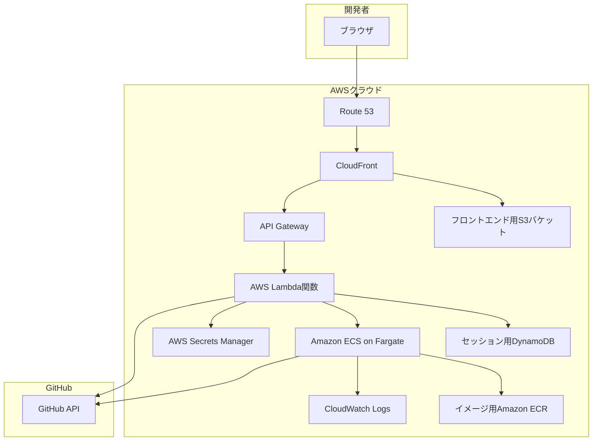

# DevFlow Engine

[](https://github.com/your-org/your-repo/actions/workflows/ci.yml)

DevFlow Engineは、自然言語の指示（プロンプト）をGitHubのプルリクエストに変換する、AIを活用した開発自動化プラットフォームです。アイデアから実装までのコーディングプロセスを効率化します。

## 概要

DevFlow Engineは、開発者がGitHubリポジトリと対話するためのWebインターフェースを提供します。リポジトリのURLと高レベルのプロンプト（例：「ReactとExpressを使ってログイン機能を追加してください」）を指定するだけで、システムがワークフロー全体を自動化します。

1.  **オンデマンド環境**: 各タスクに対して、安全で隔離されたコンテナ化環境（`code-server`）がオンデマンドでプロビジョニングされます。
2.  **AIによるコーディング**: AIエージェントがプロンプトを解釈し、リポジトリ内で直接必要なコード変更を実行します。
3.  **Gitワークフローの自動化**: システムは自動的に新しいブランチを作成し、変更をコミットし、GitHub上でプルリクエストを開きます。
4.  **反復開発**: 開発者は追加のプロンプトを発行してコードを改良したり、WebベースのIDEにアクセスして手動で調整したりできます。
5.  **セッション管理**: 全ての対話はセッションとして管理され、レビューや終了が可能です。終了すると、関連するすべてのクラウドリソースが自動的にクリーンアップされます。

このプロジェクトは、一般的なタスクの開発時間を大幅に削減し、開発者が高レベルのロジックとアーキテクチャに集中できるようにすることを目的としています。

## アーキテクチャ

システムはAWS上のサーバーレスアーキテクチャで構築されており、スケーラビリティ、セキュリティ、コスト効率を確保しています。



### 技術スタック

*   **フロントエンド**: React 18, TypeScript, Material-UI (MUI), Vite, React Query
*   **バックエンド**: Python 3.11, FastAPI, AWS Lambda, API Gateway
*   **インフラストラクチャ**: AWS CDK (TypeScript), Amazon ECS on Fargate, DynamoDB, S3, CloudFront
*   **コンテナ化**: Docker, `code-server`
*   **AI**: Anthropic Claude (`@anthropic-ai/claude-code` CLIツール経由)
*   **CI/CD**: GitHub Actions

## 機能

### ユーザー向け機能
| 機能ID | 機能名 | 概要 |
| :--- | :--- | :--- |
| **UI-001** | セッション開始とPR自動作成 | リポジトリURLとプロンプトを入力して、PRを自動生成します。 |
| **UI-002** | 追加プロンプトの実行 | 実行中のセッションにフォローアップのプロンプトを送信し、コードを改良します。 |
| **UI-003** | 履歴表示 | 現在のセッションの全てのプロンプトとシステムのアクションを時系列で表示します。 |
| **UI-004** | Webエディタへのアクセス | `code-server`のWeb IDEを開き、手動でコードを確認・編集します。 |
| **UI-005** | セッション終了 | 現在のセッションを終了し、関連する全てのクラウドリソースを解放します。 |

### システム・バックエンド機能
| 機能ID | 機能名 | 概要 |
| :--- | :--- | :--- |
| **BE-001** | オンデマンドなコンテナ管理 | ユーザーセッションごとにECS Fargateタスクを動的に開始・停止します。 |
| **BE-002** | セッション状態管理 | DynamoDBを使用してセッションの状態と履歴を永続化します。 |
| **BE-003** | AIによるコード編集 | AIエージェント（`claudecode`）を使い、プロンプトに基づいて非対話形式でコードを編集します。 |
| **BE-004** | 安全なGitHub連携 | GitHub Appと短命トークンを使用してGitHubと認証します。 |


## セットアップ手順

この手順は、ローカルでの開発・テスト用にDevFlow Engineをセットアップする方法を案内します。

### 前提条件

*   AWSアカウントと設定済みのAWS CLI
*   Node.js 18以上とnpm
*   Python 3.11以上
*   Docker
*   GitHub CLI
*   AWS CDK (`npm install -g aws-cdk`)

### 1. 初期設定

まず、AWS Secrets Managerに必要なシークレットを作成します。

```bash
# 実際の値に置き換えてください
aws secretsmanager create-secret \
  --name "devflow/github-app" \
  --description "GitHub App credentials" \
  --secret-string '{"app_id":"YOUR_APP_ID","private_key":"YOUR_PRIVATE_KEY"}'

aws secretsmanager create-secret \
  --name "devflow/claude-api-key" \
  --description "Claude API key" \
  --secret-string '{"api_key":"YOUR_CLAUDE_API_KEY"}'
```

### 2. インフラのデプロイ

CDKを使用してコアとなるAWSインフラをデプロイします。

```bash
# infrastructureディレクトリに移動
cd infrastructure

# 依存関係をインストール
npm install

# AWSアカウントでCDKをブートストラップ（未実施の場合）
cdk bootstrap

# 全てのスタックをデプロイ
cdk deploy --all
```

### 3. コンテナイメージ

`code-server`イメージをビルドし、新しく作成されたECRリポジトリにプッシュします。

```bash
# containerディレクトリに移動
cd ../container

# CDKの出力またはAWSコンソールからECRリポジトリのURIを取得
export ECR_REPO_URI="<your-ecr-repo-uri>"

# ECRにログイン
aws ecr get-login-password | docker login --username AWS --password-stdin $ECR_REPO_URI

# イメージをビルドしてプッシュ
docker build -t devflow-code-server .
docker tag devflow-code-server:latest $ECR_REPO_URI:latest
docker push $ECR_REPO_URI:latest
```

### 4. フロントエンドアプリケーション

フロントエンドアプリケーションをビルドし、S3バケットにデプロイします。

```bash
# frontendディレクトリに移動
cd ../frontend

# 依存関係をインストール
npm install

# アプリケーションをビルド
npm run build

# CDKの出力またはAWSコンソールからS3バケット名を取得
export FRONTEND_BUCKET_NAME="<your-frontend-s3-bucket-name>"

# ビルド成果物をS3に同期
aws s3 sync dist/ s3://$FRONTEND_BUCKET_NAME --delete
```

これらの手順の後、アプリケーションはCloudFrontディストリビューションのURLで利用可能になります。

## APIドキュメント

バックエンドは、セッション管理とプロンプト実行のためのRESTful APIを公開しています。

| エンドポイント | メソッド | 概要 |
| :--- | :--- | :--- |
| `/sessions` | `POST` | 新しいセッションを開始し、最初のPRを作成します。 |
| `/sessions/{id}/prompts` | `POST` | 実行中のセッションで追加のプロンプトを実行します。 |
| `/sessions/{id}` | `GET` | セッションの状態と履歴を取得します。 |
| `/sessions/{id}/editor` | `GET` | WebベースIDEのURLを取得します。 |
| `/sessions/{id}` | `DELETE` | セッションを終了し、リソースをクリーンアップします。 |

詳細なリクエスト/レスポンススキーマやエラーコードについては、[バックエンド詳細設計書](./docs/design/詳細設計/backend_design.md)を参照してください。

## プロジェクト構成

このリポジトリは、以下の構成のモノレポとして管理されています。

```
.
├── container/      # code-server環境用のDockerfileとスクリプト
├── docs/           # プロジェクト設計書
├── frontend/       # Reactフロントエンドアプリケーション (Vite)
├── infrastructure/ # AWSインフラストラクチャ (CDK)
└── readme.md       # このファイル
```

## CI/CD

このプロジェクトは、CI/CDのためにGitHub Actionsを利用しています。ワークフローは`.github/workflows`ディレクトリで定義されます（この例には含まれていません）。

*   **フロントエンドパイプライン**: `main`ブランチへのプッシュ時に、ReactアプリがビルドされてS3にデプロイされ、CloudFrontのキャッシュが無効化されます。
*   **バックエンドパイプライン**: `main`ブランチへのプッシュ時に、Lambda関数がテストされ、`cdk deploy`経由でデプロイされます。
*   **コンテナパイプライン**: `container/`ディレクトリに変更が検出されると、新しいDockerイメージがビルドされ、ECRにプッシュされます。
